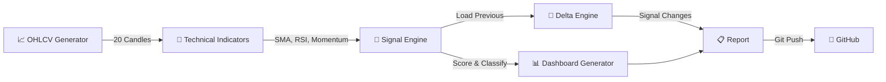
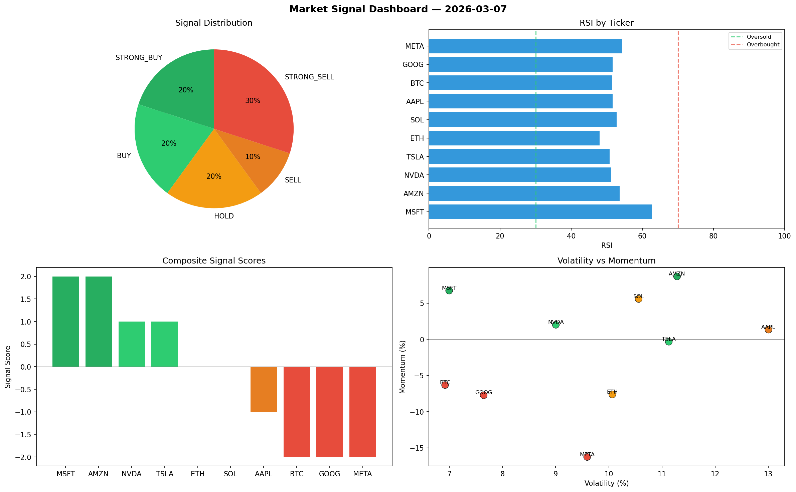

<div align="center">

# 📊 Automated Bots

[](https://github.com/Atharv279/automated-bots/actions/workflows/daily_run.yml)


**Algorithmic market signal generator with technical analysis, visual dashboards, and day-over-day delta tracking.**

*Disclaimer: Simulated data only. Not financial advice.*

</div>

---

## Architecture



## Indicators

| Indicator | Method | Signal Logic |
|-----------|--------|-------------|
| **SMA Crossover** | SMA(5) vs SMA(20) | Bullish if SMA5 > SMA20 |
| **RSI** | 14-period relative strength | Oversold < 30, Overbought > 70 |
| **Momentum** | Price change over window | Positive > 2%, Negative < -2% |
| **Volatility** | Standard deviation of returns | Risk assessment |

## Live Dashboard Preview



## Output Structure

```
logs/
├── YYYY-MM-DD.json          # Full signal data + indicators
├── YYYY-MM-DD.md            # Markdown report with delta
└── YYYY-MM-DD_dashboard.png # 4-panel visual dashboard
```

## Quick Start

```bash
pip install -r dev-requirements.txt
python main.py
```
