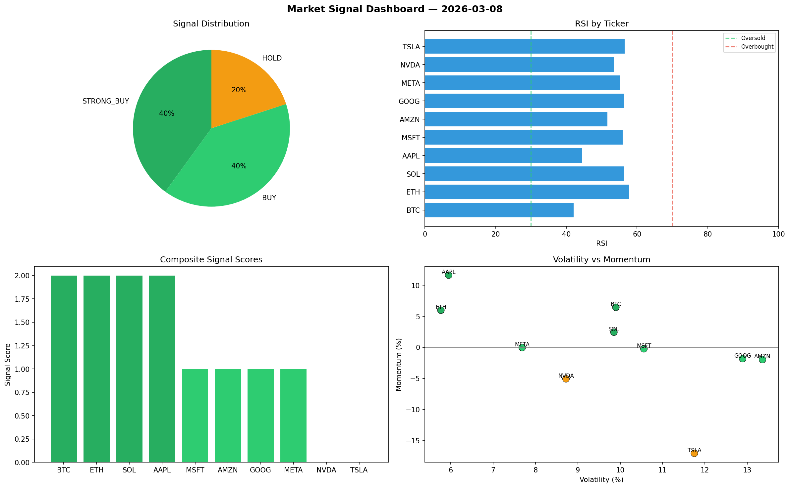

# Market Signal Report — 2026-03-08

**Run ID:** `f086598dd7` | **Buy:** 8 | **Sell:** 0 | **Hold:** 2

## Signal Dashboard

| Ticker | Price | Signal | Score | RSI | Momentum | Confidence |
|--------|-------|--------|-------|-----|----------|------------|
| BTC | $3973.1 | **STRONG_BUY** | 2 | 42.08 | 0.0646 | 0.5 |
| ETH | $3524.56 | **STRONG_BUY** | 2 | 57.75 | 0.0599 | 0.5 |
| SOL | $1421.13 | **STRONG_BUY** | 2 | 56.41 | 0.0245 | 0.5 |
| AAPL | $2252.92 | **STRONG_BUY** | 2 | 44.49 | 0.1164 | 0.5 |
| MSFT | $4434.52 | **BUY** | 1 | 55.92 | -0.0023 | 0.25 |
| AMZN | $624.17 | **BUY** | 1 | 51.63 | -0.0197 | 0.25 |
| GOOG | $3160.87 | **BUY** | 1 | 56.27 | -0.0182 | 0.25 |
| META | $4585.23 | **BUY** | 1 | 55.21 | -0.0003 | 0.25 |
| NVDA | $3808.86 | **HOLD** | 0 | 53.47 | -0.0507 | 0.0 |
| TSLA | $3510.9 | **HOLD** | 0 | 56.48 | -0.1707 | 0.0 |

## Delta vs Yesterday

| Ticker | Today | Yesterday | Price Change | Signal Changed |
|--------|-------|-----------|-------------|----------------|
| BTC | STRONG_BUY | STRONG_SELL | 📉 -14.96% | ⚠️ YES |
| ETH | STRONG_BUY | HOLD | 📈 0.92% | ⚠️ YES |
| SOL | STRONG_BUY | HOLD | 📉 -47.24% | ⚠️ YES |
| AAPL | STRONG_BUY | SELL | 📈 306.94% | ⚠️ YES |
| MSFT | BUY | STRONG_BUY | 📈 105.66% | ⚠️ YES |
| AMZN | BUY | STRONG_BUY | 📉 -65.78% | ⚠️ YES |
| GOOG | BUY | STRONG_SELL | 📉 -27.31% | ⚠️ YES |
| META | BUY | STRONG_SELL | 📈 13.69% | ⚠️ YES |
| NVDA | HOLD | BUY | 📉 -16.54% | ⚠️ YES |
| TSLA | HOLD | BUY | 📈 62.19% | ⚠️ YES |