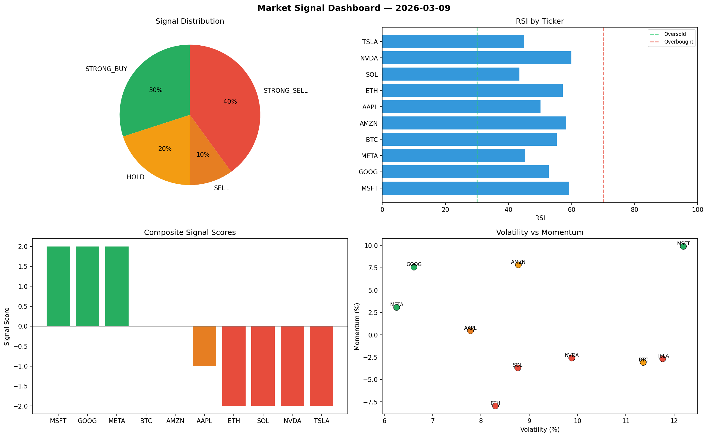

# Market Signal Report — 2026-03-09

**Run ID:** `fbda7ee82d` | **Buy:** 3 | **Sell:** 5 | **Hold:** 2

## Signal Dashboard

| Ticker | Price | Signal | Score | RSI | Momentum | Confidence |
|--------|-------|--------|-------|-----|----------|------------|
| MSFT | $2765.94 | **STRONG_BUY** | 2 | 59.21 | 0.0989 | 0.5 |
| GOOG | $1584.34 | **STRONG_BUY** | 2 | 52.79 | 0.0757 | 0.5 |
| META | $1024.26 | **STRONG_BUY** | 2 | 45.33 | 0.0306 | 0.5 |
| BTC | $1310.99 | **HOLD** | 0 | 55.34 | -0.0309 | 0.0 |
| AMZN | $2883.27 | **HOLD** | 0 | 58.26 | 0.0783 | 0.0 |
| AAPL | $681.97 | **SELL** | -1 | 50.13 | 0.0045 | 0.25 |
| ETH | $2661.16 | **STRONG_SELL** | -2 | 57.2 | -0.0796 | 0.5 |
| SOL | $2094.97 | **STRONG_SELL** | -2 | 43.48 | -0.037 | 0.5 |
| NVDA | $2304.15 | **STRONG_SELL** | -2 | 59.91 | -0.026 | 0.5 |
| TSLA | $3468.08 | **STRONG_SELL** | -2 | 45.02 | -0.0268 | 0.5 |

## Delta vs Yesterday

| Ticker | Today | Yesterday | Price Change | Signal Changed |
|--------|-------|-----------|-------------|----------------|
| MSFT | STRONG_BUY | SELL | 📈 23.08% | ⚠️ YES |
| GOOG | STRONG_BUY | HOLD | 📉 -46.3% | ⚠️ YES |
| META | STRONG_BUY | BUY | 📈 1457.34% | ⚠️ YES |
| BTC | HOLD | HOLD | 📉 -71.1% | — |
| AMZN | HOLD | STRONG_SELL | 📈 1889.29% | ⚠️ YES |
| AAPL | SELL | STRONG_SELL | 📈 272.56% | ⚠️ YES |
| ETH | STRONG_SELL | STRONG_BUY | 📉 -26.35% | ⚠️ YES |
| SOL | STRONG_SELL | SELL | 📉 -51.47% | ⚠️ YES |
| NVDA | STRONG_SELL | STRONG_BUY | 📉 -43.48% | ⚠️ YES |
| TSLA | STRONG_SELL | HOLD | 📉 -16.13% | ⚠️ YES |