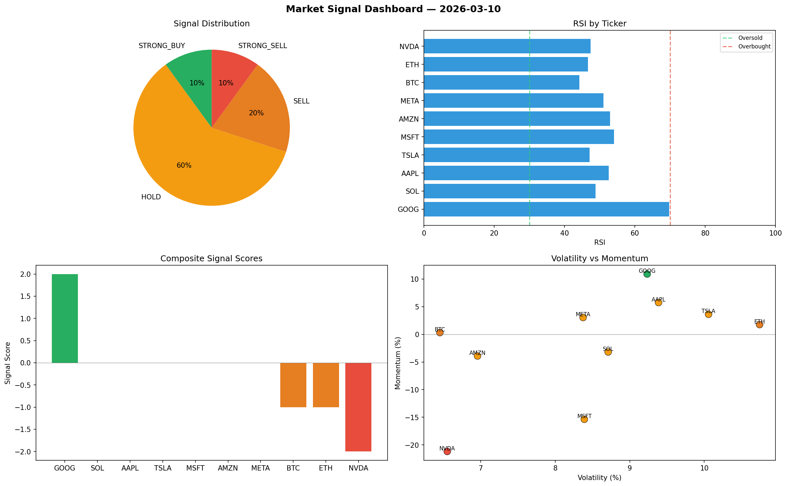

# Market Signal Report — 2026-03-10

**Run ID:** `715ce50321` | **Buy:** 1 | **Sell:** 3 | **Hold:** 6

## Signal Dashboard

| Ticker | Price | Signal | Score | RSI | Momentum | Confidence |
|--------|-------|--------|-------|-----|----------|------------|
| GOOG | $3845.37 | **STRONG_BUY** | 2 | 69.76 | 0.1091 | 0.5 |
| SOL | $1763.29 | **HOLD** | 0 | 48.84 | -0.032 | 0.0 |
| AAPL | $2896.01 | **HOLD** | 0 | 52.52 | 0.0575 | 0.0 |
| TSLA | $763.41 | **HOLD** | 0 | 47.14 | 0.0363 | 0.0 |
| MSFT | $256.6 | **HOLD** | 0 | 54.06 | -0.1537 | 0.0 |
| AMZN | $3908.51 | **HOLD** | 0 | 52.94 | -0.0392 | 0.0 |
| META | $3965.55 | **HOLD** | 0 | 51.05 | 0.0304 | 0.0 |
| BTC | $2994.15 | **SELL** | -1 | 44.23 | 0.0031 | 0.25 |
| ETH | $4121.63 | **SELL** | -1 | 46.66 | 0.0176 | 0.25 |
| NVDA | $1176.44 | **STRONG_SELL** | -2 | 47.4 | -0.2119 | 0.5 |

## Delta vs Yesterday

| Ticker | Today | Yesterday | Price Change | Signal Changed |
|--------|-------|-----------|-------------|----------------|
| GOOG | STRONG_BUY | BUY | 📈 47.02% | ⚠️ YES |
| SOL | HOLD | HOLD | 📈 19.65% | — |
| AAPL | HOLD | HOLD | 📈 75.47% | — |
| TSLA | HOLD | STRONG_SELL | 📉 -83.44% | ⚠️ YES |
| MSFT | HOLD | STRONG_BUY | 📉 -81.02% | ⚠️ YES |
| AMZN | HOLD | HOLD | 📈 75.05% | — |
| META | HOLD | STRONG_BUY | 📉 -24.01% | ⚠️ YES |
| BTC | SELL | STRONG_SELL | 📉 -23.94% | ⚠️ YES |
| ETH | SELL | STRONG_SELL | 📈 78.85% | ⚠️ YES |
| NVDA | STRONG_SELL | STRONG_BUY | 📈 32.3% | ⚠️ YES |