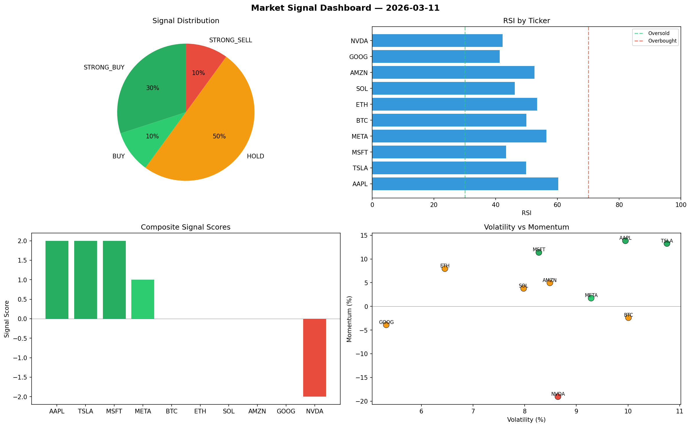

# Market Signal Report — 2026-03-11

**Run ID:** `c382e515ee` | **Buy:** 4 | **Sell:** 1 | **Hold:** 5

## Signal Dashboard

| Ticker | Price | Signal | Score | RSI | Momentum | Confidence |
|--------|-------|--------|-------|-----|----------|------------|
| AAPL | $207.35 | **STRONG_BUY** | 2 | 60.3 | 0.1384 | 0.5 |
| TSLA | $4176.75 | **STRONG_BUY** | 2 | 49.83 | 0.1326 | 0.5 |
| MSFT | $3706.57 | **STRONG_BUY** | 2 | 43.4 | 0.1138 | 0.5 |
| META | $1701.0 | **BUY** | 1 | 56.4 | 0.0173 | 0.25 |
| BTC | $2570.38 | **HOLD** | 0 | 49.93 | -0.0239 | 0.0 |
| ETH | $3841.64 | **HOLD** | 0 | 53.41 | 0.0796 | 0.0 |
| SOL | $3957.56 | **HOLD** | 0 | 46.18 | 0.0379 | 0.0 |
| AMZN | $58.59 | **HOLD** | 0 | 52.52 | 0.0496 | 0.0 |
| GOOG | $2352.99 | **HOLD** | 0 | 41.27 | -0.039 | 0.0 |
| NVDA | $202.96 | **STRONG_SELL** | -2 | 42.23 | -0.1906 | 0.5 |

## Delta vs Yesterday

| Ticker | Today | Yesterday | Price Change | Signal Changed |
|--------|-------|-----------|-------------|----------------|
| AAPL | STRONG_BUY | STRONG_BUY | 📉 -88.06% | — |
| TSLA | STRONG_BUY | STRONG_SELL | 📈 757.77% | ⚠️ YES |
| MSFT | STRONG_BUY | STRONG_SELL | 📈 28.73% | ⚠️ YES |
| META | BUY | STRONG_BUY | 📉 -29.19% | ⚠️ YES |
| BTC | HOLD | STRONG_SELL | 📈 157.42% | ⚠️ YES |
| ETH | HOLD | STRONG_BUY | 📈 34.3% | ⚠️ YES |
| SOL | HOLD | SELL | 📈 8.01% | ⚠️ YES |
| AMZN | HOLD | STRONG_BUY | 📉 -98.69% | ⚠️ YES |
| GOOG | HOLD | STRONG_BUY | 📉 -50.36% | ⚠️ YES |
| NVDA | STRONG_SELL | BUY | 📉 -95.19% | ⚠️ YES |