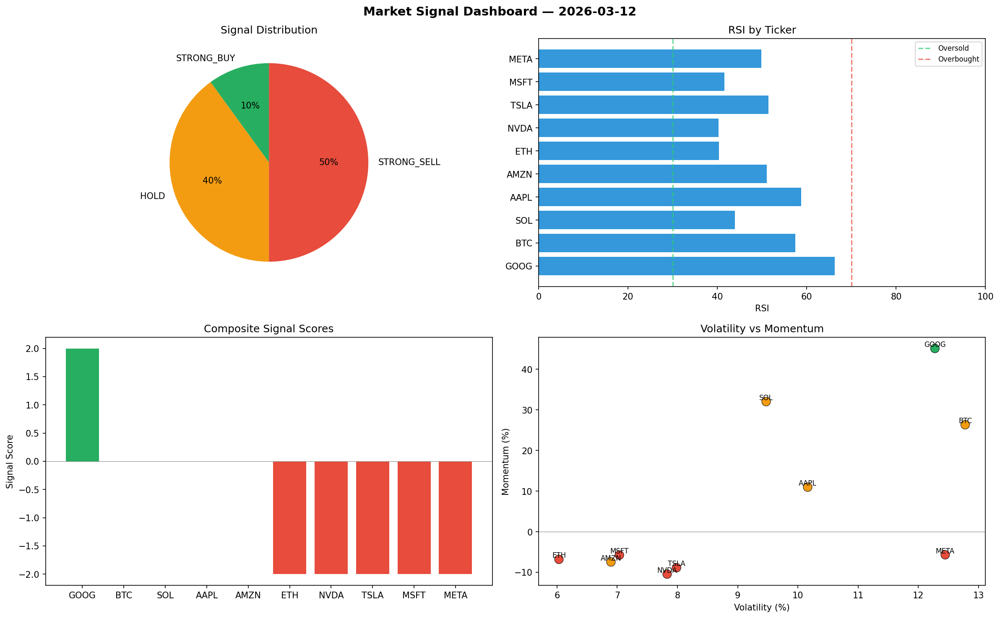

# Market Signal Report — 2026-03-12

**Run ID:** `ed37966cd4` | **Buy:** 1 | **Sell:** 5 | **Hold:** 4

## Signal Dashboard

| Ticker | Price | Signal | Score | RSI | Momentum | Confidence |
|--------|-------|--------|-------|-----|----------|------------|
| GOOG | $3728.2 | **STRONG_BUY** | 2 | 66.29 | 0.4514 | 0.5 |
| BTC | $2144.35 | **HOLD** | 0 | 57.45 | 0.2635 | 0.0 |
| SOL | $3699.92 | **HOLD** | 0 | 43.9 | 0.3205 | 0.0 |
| AAPL | $4211.38 | **HOLD** | 0 | 58.73 | 0.1098 | 0.0 |
| AMZN | $2973.76 | **HOLD** | 0 | 51.09 | -0.0744 | 0.0 |
| ETH | $1673.84 | **STRONG_SELL** | -2 | 40.38 | -0.068 | 0.5 |
| NVDA | $4648.07 | **STRONG_SELL** | -2 | 40.25 | -0.1043 | 0.5 |
| TSLA | $1378.17 | **STRONG_SELL** | -2 | 51.41 | -0.0886 | 0.5 |
| MSFT | $746.51 | **STRONG_SELL** | -2 | 41.59 | -0.0575 | 0.5 |
| META | $4867.68 | **STRONG_SELL** | -2 | 49.87 | -0.0568 | 0.5 |

## Delta vs Yesterday

| Ticker | Today | Yesterday | Price Change | Signal Changed |
|--------|-------|-----------|-------------|----------------|
| GOOG | STRONG_BUY | HOLD | 📉 -15.9% | ⚠️ YES |
| BTC | HOLD | STRONG_SELL | 📈 121.82% | ⚠️ YES |
| SOL | HOLD | HOLD | 📈 56.99% | — |
| AAPL | HOLD | HOLD | 📉 -6.63% | — |
| AMZN | HOLD | STRONG_BUY | 📈 39.79% | ⚠️ YES |
| ETH | STRONG_SELL | SELL | 📉 -14.96% | ⚠️ YES |
| NVDA | STRONG_SELL | STRONG_SELL | 📈 12.03% | — |
| TSLA | STRONG_SELL | STRONG_SELL | 📈 101.7% | — |
| MSFT | STRONG_SELL | STRONG_SELL | 📈 99.47% | — |
| META | STRONG_SELL | BUY | 📈 2177.6% | ⚠️ YES |