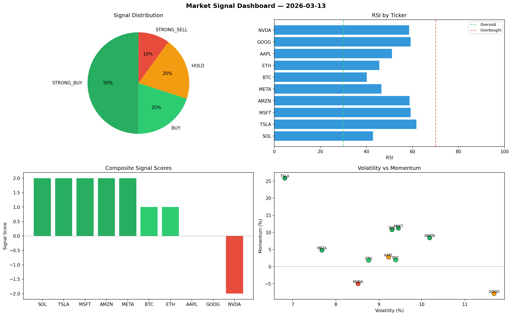

# Market Signal Report — 2026-03-13

**Run ID:** `1235f911c5` | **Buy:** 7 | **Sell:** 1 | **Hold:** 2

## Signal Dashboard

| Ticker | Price | Signal | Score | RSI | Momentum | Confidence |
|--------|-------|--------|-------|-----|----------|------------|
| SOL | $4848.74 | **STRONG_BUY** | 2 | 42.89 | 0.1077 | 0.5 |
| TSLA | $3774.09 | **STRONG_BUY** | 2 | 61.76 | 0.2584 | 0.5 |
| MSFT | $4210.79 | **STRONG_BUY** | 2 | 59.24 | 0.1123 | 0.5 |
| AMZN | $3016.49 | **STRONG_BUY** | 2 | 58.72 | 0.0842 | 0.5 |
| META | $335.1 | **STRONG_BUY** | 2 | 46.51 | 0.048 | 0.5 |
| BTC | $3678.5 | **BUY** | 1 | 40.15 | 0.0195 | 0.25 |
| ETH | $2578.79 | **BUY** | 1 | 45.57 | 0.0183 | 0.25 |
| AAPL | $756.9 | **HOLD** | 0 | 51.05 | 0.0277 | 0.0 |
| GOOG | $1321.01 | **HOLD** | 0 | 59.21 | -0.0787 | 0.0 |
| NVDA | $3954.55 | **STRONG_SELL** | -2 | 58.55 | -0.0499 | 0.5 |

## Delta vs Yesterday

| Ticker | Today | Yesterday | Price Change | Signal Changed |
|--------|-------|-----------|-------------|----------------|
| SOL | STRONG_BUY | STRONG_BUY | 📈 187.33% | — |
| TSLA | STRONG_BUY | STRONG_BUY | 📈 2039.99% | — |
| MSFT | STRONG_BUY | STRONG_BUY | 📈 1357.02% | — |
| AMZN | STRONG_BUY | STRONG_SELL | 📉 -21.99% | ⚠️ YES |
| META | STRONG_BUY | STRONG_BUY | 📉 -91.62% | — |
| BTC | BUY | STRONG_BUY | 📈 169.0% | ⚠️ YES |
| ETH | BUY | STRONG_BUY | 📉 -0.32% | ⚠️ YES |
| AAPL | HOLD | STRONG_BUY | 📉 -52.57% | ⚠️ YES |
| GOOG | HOLD | STRONG_BUY | 📈 73.83% | ⚠️ YES |
| NVDA | STRONG_SELL | STRONG_BUY | 📈 117.49% | ⚠️ YES |