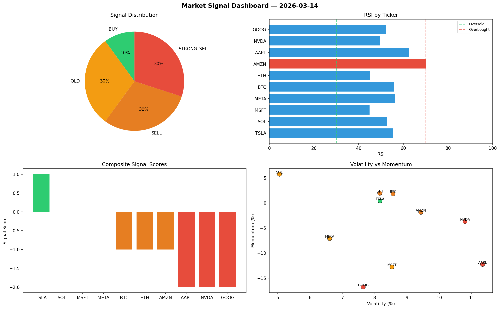

# Market Signal Report — 2026-03-14

**Run ID:** `ad37734aa4` | **Buy:** 1 | **Sell:** 6 | **Hold:** 3

## Signal Dashboard

| Ticker | Price | Signal | Score | RSI | Momentum | Confidence |
|--------|-------|--------|-------|-----|----------|------------|
| TSLA | $3934.98 | **BUY** | 1 | 55.34 | 0.0039 | 0.25 |
| SOL | $2128.27 | **HOLD** | 0 | 52.75 | 0.0573 | 0.0 |
| MSFT | $1939.37 | **HOLD** | 0 | 44.89 | -0.1278 | 0.0 |
| META | $1412.89 | **HOLD** | 0 | 56.38 | -0.071 | 0.0 |
| BTC | $1649.31 | **SELL** | -1 | 55.83 | 0.0183 | 0.25 |
| ETH | $2362.04 | **SELL** | -1 | 45.22 | 0.0193 | 0.25 |
| AMZN | $4984.96 | **SELL** | -1 | 70.31 | -0.0187 | 0.25 |
| AAPL | $3997.11 | **STRONG_SELL** | -2 | 62.62 | -0.1226 | 0.5 |
| NVDA | $2856.68 | **STRONG_SELL** | -2 | 49.57 | -0.037 | 0.5 |
| GOOG | $980.36 | **STRONG_SELL** | -2 | 52.07 | -0.1678 | 0.5 |

## Delta vs Yesterday

| Ticker | Today | Yesterday | Price Change | Signal Changed |
|--------|-------|-----------|-------------|----------------|
| TSLA | BUY | HOLD | 📉 -24.66% | ⚠️ YES |
| SOL | HOLD | STRONG_SELL | 📉 -0.78% | ⚠️ YES |
| MSFT | HOLD | BUY | 📈 1233.73% | ⚠️ YES |
| META | HOLD | BUY | 📉 -59.95% | ⚠️ YES |
| BTC | SELL | HOLD | 📉 -22.96% | ⚠️ YES |
| ETH | SELL | STRONG_SELL | 📈 0.18% | ⚠️ YES |
| AMZN | SELL | STRONG_BUY | 📈 422.47% | ⚠️ YES |
| AAPL | STRONG_SELL | STRONG_BUY | 📈 14.06% | ⚠️ YES |
| NVDA | STRONG_SELL | SELL | 📈 480.33% | ⚠️ YES |
| GOOG | STRONG_SELL | STRONG_SELL | 📉 -7.4% | — |