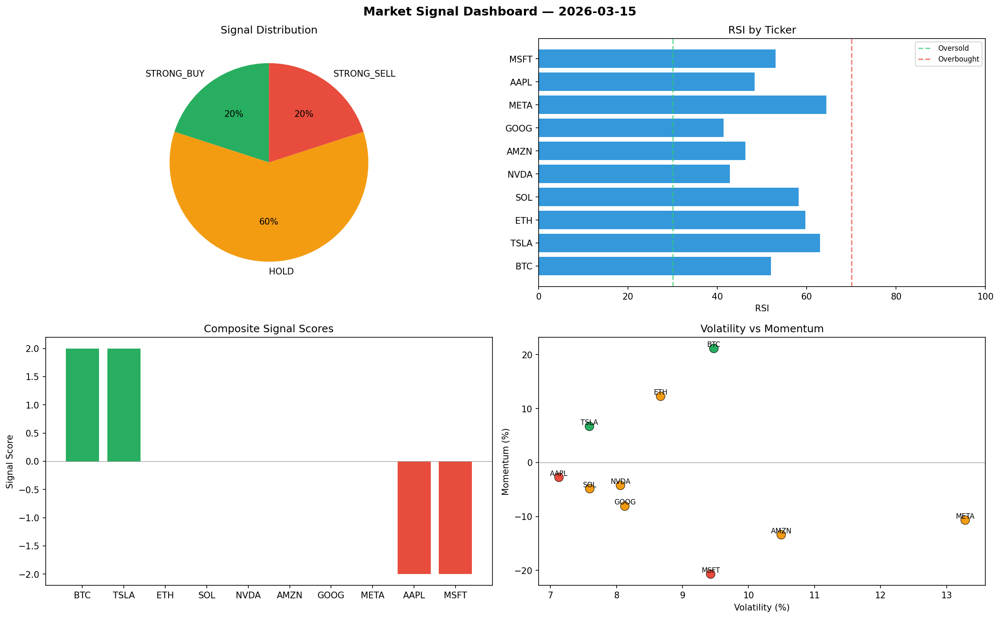

# Market Signal Report — 2026-03-15

**Run ID:** `fb037501ad` | **Buy:** 2 | **Sell:** 2 | **Hold:** 6

## Signal Dashboard

| Ticker | Price | Signal | Score | RSI | Momentum | Confidence |
|--------|-------|--------|-------|-----|----------|------------|
| BTC | $2771.98 | **STRONG_BUY** | 2 | 51.97 | 0.2115 | 0.5 |
| TSLA | $1121.38 | **STRONG_BUY** | 2 | 63.0 | 0.0671 | 0.5 |
| ETH | $555.59 | **HOLD** | 0 | 59.66 | 0.1229 | 0.0 |
| SOL | $1988.18 | **HOLD** | 0 | 58.17 | -0.0485 | 0.0 |
| NVDA | $1049.53 | **HOLD** | 0 | 42.77 | -0.0424 | 0.0 |
| AMZN | $2992.5 | **HOLD** | 0 | 46.27 | -0.1339 | 0.0 |
| GOOG | $2389.61 | **HOLD** | 0 | 41.4 | -0.0808 | 0.0 |
| META | $2184.2 | **HOLD** | 0 | 64.35 | -0.1067 | 0.0 |
| AAPL | $2186.48 | **STRONG_SELL** | -2 | 48.29 | -0.0274 | 0.5 |
| MSFT | $4041.14 | **STRONG_SELL** | -2 | 53.06 | -0.2068 | 0.5 |

## Delta vs Yesterday

| Ticker | Today | Yesterday | Price Change | Signal Changed |
|--------|-------|-----------|-------------|----------------|
| BTC | STRONG_BUY | SELL | 📈 68.07% | ⚠️ YES |
| TSLA | STRONG_BUY | BUY | 📉 -71.5% | ⚠️ YES |
| ETH | HOLD | SELL | 📉 -76.48% | ⚠️ YES |
| SOL | HOLD | HOLD | 📉 -6.58% | — |
| NVDA | HOLD | STRONG_SELL | 📉 -63.26% | ⚠️ YES |
| AMZN | HOLD | SELL | 📉 -39.97% | ⚠️ YES |
| GOOG | HOLD | STRONG_SELL | 📈 143.75% | ⚠️ YES |
| META | HOLD | HOLD | 📈 54.59% | — |
| AAPL | STRONG_SELL | STRONG_SELL | 📉 -45.3% | — |
| MSFT | STRONG_SELL | HOLD | 📈 108.37% | ⚠️ YES |