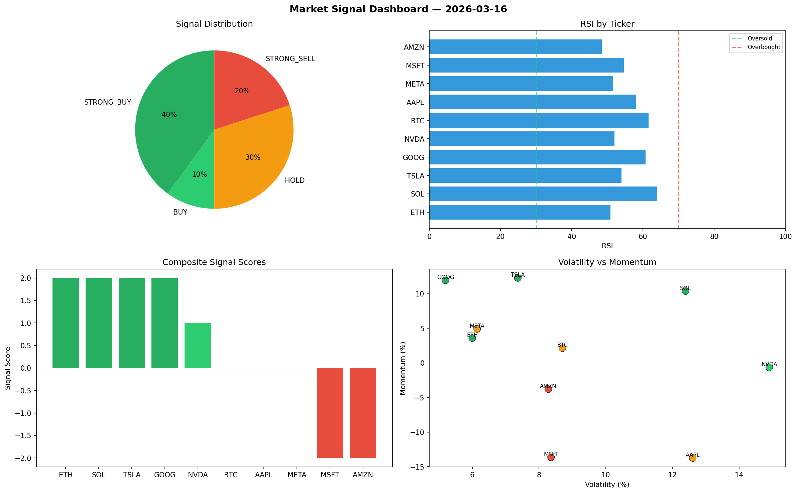

# Market Signal Report — 2026-03-16

**Run ID:** `45d0c87076` | **Buy:** 5 | **Sell:** 2 | **Hold:** 3

## Signal Dashboard

| Ticker | Price | Signal | Score | RSI | Momentum | Confidence |
|--------|-------|--------|-------|-----|----------|------------|
| ETH | $5032.23 | **STRONG_BUY** | 2 | 50.86 | 0.036 | 0.5 |
| SOL | $2341.27 | **STRONG_BUY** | 2 | 64.04 | 0.1037 | 0.5 |
| TSLA | $2068.52 | **STRONG_BUY** | 2 | 53.96 | 0.1227 | 0.5 |
| GOOG | $3224.06 | **STRONG_BUY** | 2 | 60.69 | 0.1193 | 0.5 |
| NVDA | $4700.91 | **BUY** | 1 | 51.97 | -0.0066 | 0.25 |
| BTC | $1131.0 | **HOLD** | 0 | 61.61 | 0.0213 | 0.0 |
| AAPL | $2067.17 | **HOLD** | 0 | 57.96 | -0.1373 | 0.0 |
| META | $575.18 | **HOLD** | 0 | 51.63 | 0.0491 | 0.0 |
| MSFT | $3667.94 | **STRONG_SELL** | -2 | 54.63 | -0.1363 | 0.5 |
| AMZN | $1009.86 | **STRONG_SELL** | -2 | 48.39 | -0.0379 | 0.5 |

## Delta vs Yesterday

| Ticker | Today | Yesterday | Price Change | Signal Changed |
|--------|-------|-----------|-------------|----------------|
| ETH | STRONG_BUY | STRONG_BUY | 📈 0.83% | — |
| SOL | STRONG_BUY | STRONG_SELL | 📉 -45.13% | ⚠️ YES |
| TSLA | STRONG_BUY | STRONG_SELL | 📉 -41.22% | ⚠️ YES |
| GOOG | STRONG_BUY | HOLD | 📉 -17.26% | ⚠️ YES |
| NVDA | BUY | HOLD | 📈 83.35% | ⚠️ YES |
| BTC | HOLD | STRONG_BUY | 📈 2589.66% | ⚠️ YES |
| AAPL | HOLD | HOLD | 📈 429.79% | — |
| META | HOLD | HOLD | 📉 -59.26% | — |
| MSFT | STRONG_SELL | STRONG_SELL | 📈 8.66% | — |
| AMZN | STRONG_SELL | BUY | 📉 -64.81% | ⚠️ YES |