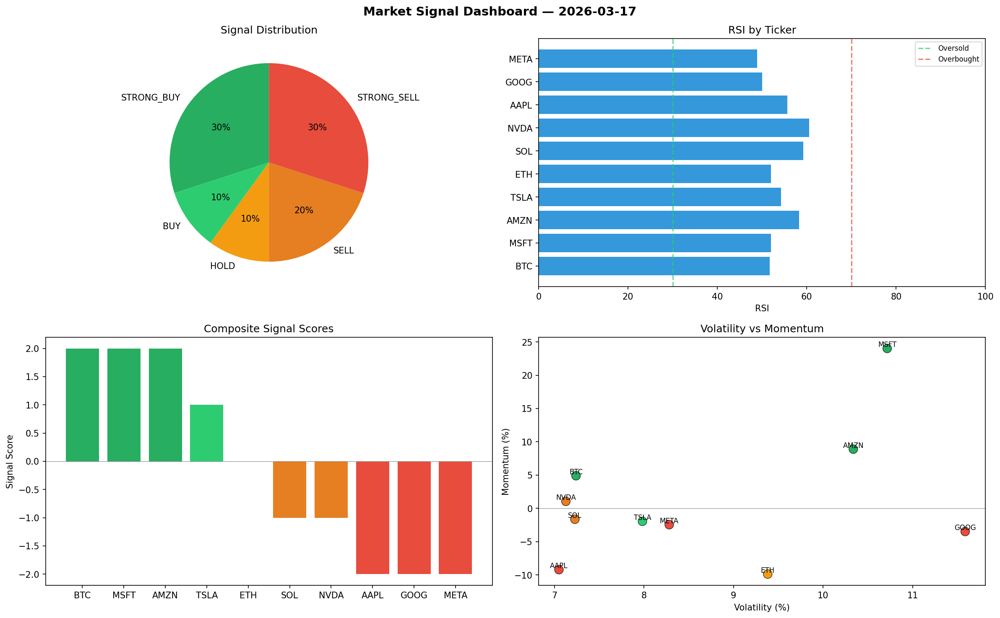

# Market Signal Report — 2026-03-17

**Run ID:** `f69ab77914` | **Buy:** 4 | **Sell:** 5 | **Hold:** 1

## Signal Dashboard

| Ticker | Price | Signal | Score | RSI | Momentum | Confidence |
|--------|-------|--------|-------|-----|----------|------------|
| BTC | $683.62 | **STRONG_BUY** | 2 | 51.71 | 0.0489 | 0.5 |
| MSFT | $1436.31 | **STRONG_BUY** | 2 | 52.02 | 0.2402 | 0.5 |
| AMZN | $800.65 | **STRONG_BUY** | 2 | 58.31 | 0.0889 | 0.5 |
| TSLA | $2626.78 | **BUY** | 1 | 54.24 | -0.0195 | 0.25 |
| ETH | $74.39 | **HOLD** | 0 | 51.97 | -0.0988 | 0.0 |
| SOL | $1751.1 | **SELL** | -1 | 59.25 | -0.0164 | 0.25 |
| NVDA | $602.13 | **SELL** | -1 | 60.53 | 0.0105 | 0.25 |
| AAPL | $4052.94 | **STRONG_SELL** | -2 | 55.69 | -0.0922 | 0.5 |
| GOOG | $1270.45 | **STRONG_SELL** | -2 | 49.99 | -0.0349 | 0.5 |
| META | $2493.93 | **STRONG_SELL** | -2 | 48.87 | -0.0246 | 0.5 |

## Delta vs Yesterday

| Ticker | Today | Yesterday | Price Change | Signal Changed |
|--------|-------|-----------|-------------|----------------|
| BTC | STRONG_BUY | HOLD | 📉 -39.56% | ⚠️ YES |
| MSFT | STRONG_BUY | STRONG_SELL | 📉 -60.84% | ⚠️ YES |
| AMZN | STRONG_BUY | STRONG_SELL | 📉 -20.72% | ⚠️ YES |
| TSLA | BUY | STRONG_BUY | 📈 26.99% | ⚠️ YES |
| ETH | HOLD | STRONG_BUY | 📉 -98.52% | ⚠️ YES |
| SOL | SELL | STRONG_BUY | 📉 -25.21% | ⚠️ YES |
| NVDA | SELL | BUY | 📉 -87.19% | ⚠️ YES |
| AAPL | STRONG_SELL | HOLD | 📈 96.06% | ⚠️ YES |
| GOOG | STRONG_SELL | STRONG_BUY | 📉 -60.59% | ⚠️ YES |
| META | STRONG_SELL | HOLD | 📈 333.59% | ⚠️ YES |