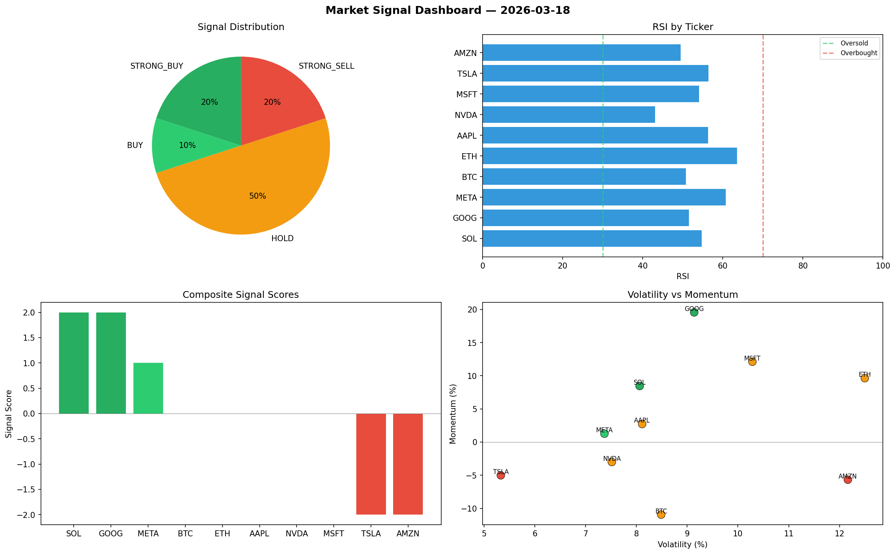

# Market Signal Report — 2026-03-18

**Run ID:** `29369372dc` | **Buy:** 3 | **Sell:** 2 | **Hold:** 5

## Signal Dashboard

| Ticker | Price | Signal | Score | RSI | Momentum | Confidence |
|--------|-------|--------|-------|-----|----------|------------|
| SOL | $1641.88 | **STRONG_BUY** | 2 | 54.69 | 0.0845 | 0.5 |
| GOOG | $383.02 | **STRONG_BUY** | 2 | 51.57 | 0.1955 | 0.5 |
| META | $86.06 | **BUY** | 1 | 60.74 | 0.0127 | 0.25 |
| BTC | $2758.97 | **HOLD** | 0 | 50.82 | -0.1094 | 0.0 |
| ETH | $1155.31 | **HOLD** | 0 | 63.51 | 0.0963 | 0.0 |
| AAPL | $705.54 | **HOLD** | 0 | 56.28 | 0.0272 | 0.0 |
| NVDA | $3171.26 | **HOLD** | 0 | 43.08 | -0.0301 | 0.0 |
| MSFT | $2104.28 | **HOLD** | 0 | 54.04 | 0.1211 | 0.0 |
| TSLA | $4253.67 | **STRONG_SELL** | -2 | 56.37 | -0.0502 | 0.5 |
| AMZN | $3099.2 | **STRONG_SELL** | -2 | 49.45 | -0.0568 | 0.5 |

## Delta vs Yesterday

| Ticker | Today | Yesterday | Price Change | Signal Changed |
|--------|-------|-----------|-------------|----------------|
| SOL | STRONG_BUY | SELL | 📉 -6.24% | ⚠️ YES |
| GOOG | STRONG_BUY | STRONG_SELL | 📉 -69.85% | ⚠️ YES |
| META | BUY | STRONG_SELL | 📉 -96.55% | ⚠️ YES |
| BTC | HOLD | STRONG_BUY | 📈 303.58% | ⚠️ YES |
| ETH | HOLD | HOLD | 📈 1453.04% | — |
| AAPL | HOLD | STRONG_SELL | 📉 -82.59% | ⚠️ YES |
| NVDA | HOLD | SELL | 📈 426.67% | ⚠️ YES |
| MSFT | HOLD | STRONG_BUY | 📈 46.51% | ⚠️ YES |
| TSLA | STRONG_SELL | BUY | 📈 61.93% | ⚠️ YES |
| AMZN | STRONG_SELL | STRONG_BUY | 📈 287.09% | ⚠️ YES |