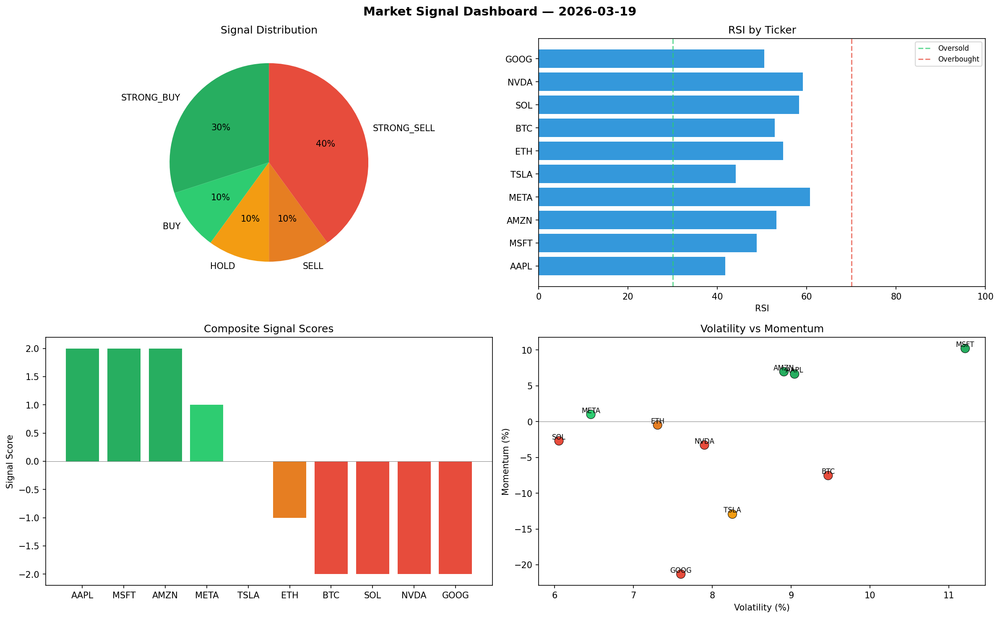

# Market Signal Report — 2026-03-19

**Run ID:** `08be3e06f4` | **Buy:** 4 | **Sell:** 5 | **Hold:** 1

## Signal Dashboard

| Ticker | Price | Signal | Score | RSI | Momentum | Confidence |
|--------|-------|--------|-------|-----|----------|------------|
| AAPL | $4224.1 | **STRONG_BUY** | 2 | 41.76 | 0.0665 | 0.5 |
| MSFT | $5221.82 | **STRONG_BUY** | 2 | 48.77 | 0.1022 | 0.5 |
| AMZN | $3478.41 | **STRONG_BUY** | 2 | 53.17 | 0.0697 | 0.5 |
| META | $4475.25 | **BUY** | 1 | 60.75 | 0.0101 | 0.25 |
| TSLA | $1568.15 | **HOLD** | 0 | 44.15 | -0.1292 | 0.0 |
| ETH | $3802.12 | **SELL** | -1 | 54.71 | -0.0047 | 0.25 |
| BTC | $1743.31 | **STRONG_SELL** | -2 | 52.88 | -0.0753 | 0.5 |
| SOL | $1311.05 | **STRONG_SELL** | -2 | 58.28 | -0.0269 | 0.5 |
| NVDA | $4537.33 | **STRONG_SELL** | -2 | 59.13 | -0.0327 | 0.5 |
| GOOG | $1641.13 | **STRONG_SELL** | -2 | 50.45 | -0.213 | 0.5 |

## Delta vs Yesterday

| Ticker | Today | Yesterday | Price Change | Signal Changed |
|--------|-------|-----------|-------------|----------------|
| AAPL | STRONG_BUY | HOLD | 📈 498.7% | ⚠️ YES |
| MSFT | STRONG_BUY | HOLD | 📈 148.15% | ⚠️ YES |
| AMZN | STRONG_BUY | STRONG_SELL | 📈 12.24% | ⚠️ YES |
| META | BUY | BUY | 📈 5100.15% | — |
| TSLA | HOLD | STRONG_SELL | 📉 -63.13% | ⚠️ YES |
| ETH | SELL | HOLD | 📈 229.1% | ⚠️ YES |
| BTC | STRONG_SELL | HOLD | 📉 -36.81% | ⚠️ YES |
| SOL | STRONG_SELL | STRONG_BUY | 📉 -20.15% | ⚠️ YES |
| NVDA | STRONG_SELL | HOLD | 📈 43.08% | ⚠️ YES |
| GOOG | STRONG_SELL | STRONG_BUY | 📈 328.47% | ⚠️ YES |