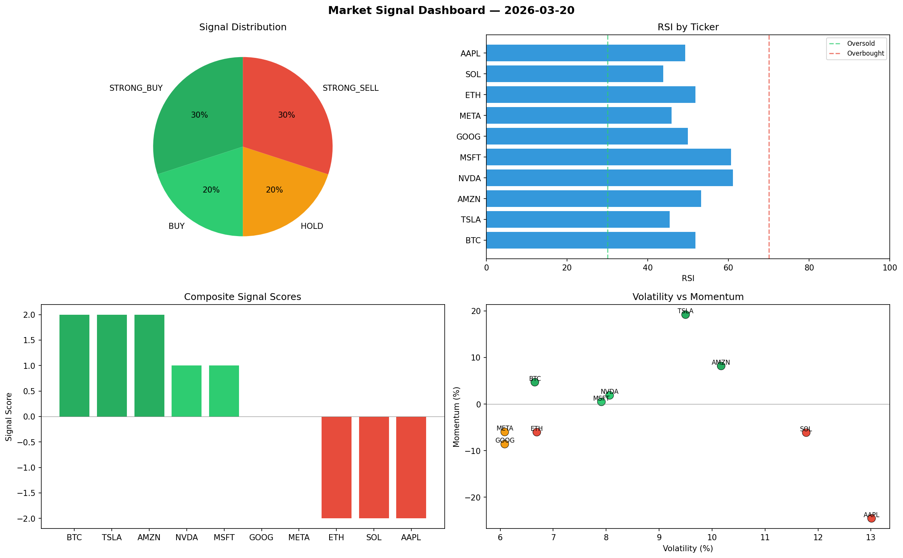

# Market Signal Report — 2026-03-20

**Run ID:** `b5566ab454` | **Buy:** 5 | **Sell:** 3 | **Hold:** 2

## Signal Dashboard

| Ticker | Price | Signal | Score | RSI | Momentum | Confidence |
|--------|-------|--------|-------|-----|----------|------------|
| BTC | $3369.97 | **STRONG_BUY** | 2 | 51.84 | 0.0469 | 0.5 |
| TSLA | $44.05 | **STRONG_BUY** | 2 | 45.45 | 0.1918 | 0.5 |
| AMZN | $1495.89 | **STRONG_BUY** | 2 | 53.17 | 0.0817 | 0.5 |
| NVDA | $1362.77 | **BUY** | 1 | 61.06 | 0.0187 | 0.25 |
| MSFT | $1636.99 | **BUY** | 1 | 60.66 | 0.0047 | 0.25 |
| GOOG | $3872.6 | **HOLD** | 0 | 49.92 | -0.0859 | 0.0 |
| META | $571.93 | **HOLD** | 0 | 45.86 | -0.0599 | 0.0 |
| ETH | $1323.01 | **STRONG_SELL** | -2 | 51.77 | -0.0603 | 0.5 |
| SOL | $365.85 | **STRONG_SELL** | -2 | 43.83 | -0.0613 | 0.5 |
| AAPL | $43.41 | **STRONG_SELL** | -2 | 49.29 | -0.2452 | 0.5 |

## Delta vs Yesterday

| Ticker | Today | Yesterday | Price Change | Signal Changed |
|--------|-------|-----------|-------------|----------------|
| BTC | STRONG_BUY | HOLD | 📉 -23.75% | ⚠️ YES |
| TSLA | STRONG_BUY | STRONG_SELL | 📉 -98.88% | ⚠️ YES |
| AMZN | STRONG_BUY | STRONG_SELL | 📈 0.06% | ⚠️ YES |
| NVDA | BUY | STRONG_SELL | 📉 -69.96% | ⚠️ YES |
| MSFT | BUY | STRONG_SELL | 📈 190.42% | ⚠️ YES |
| GOOG | HOLD | STRONG_SELL | 📈 14.21% | ⚠️ YES |
| META | HOLD | HOLD | 📉 -77.47% | — |
| ETH | STRONG_SELL | HOLD | 📉 -67.41% | ⚠️ YES |
| SOL | STRONG_SELL | STRONG_BUY | 📉 -93.07% | ⚠️ YES |
| AAPL | STRONG_SELL | HOLD | 📉 -97.31% | ⚠️ YES |