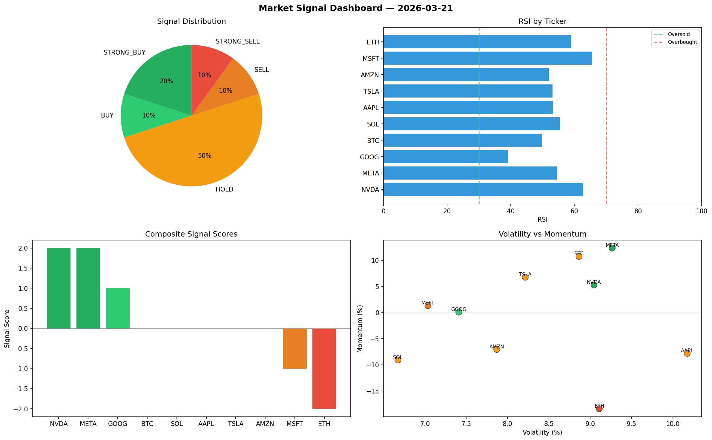

# Market Signal Report — 2026-03-21

**Run ID:** `09207f837f` | **Buy:** 3 | **Sell:** 2 | **Hold:** 5

## Signal Dashboard

| Ticker | Price | Signal | Score | RSI | Momentum | Confidence |
|--------|-------|--------|-------|-----|----------|------------|
| NVDA | $3514.22 | **STRONG_BUY** | 2 | 62.69 | 0.0527 | 0.5 |
| META | $130.54 | **STRONG_BUY** | 2 | 54.56 | 0.1233 | 0.5 |
| GOOG | $5015.18 | **BUY** | 1 | 39.08 | 0.0007 | 0.25 |
| BTC | $3453.16 | **HOLD** | 0 | 49.75 | 0.1074 | 0.0 |
| SOL | $3776.12 | **HOLD** | 0 | 55.42 | -0.0909 | 0.0 |
| AAPL | $2551.64 | **HOLD** | 0 | 53.18 | -0.0781 | 0.0 |
| TSLA | $2608.84 | **HOLD** | 0 | 53.1 | 0.0675 | 0.0 |
| AMZN | $531.11 | **HOLD** | 0 | 52.08 | -0.0705 | 0.0 |
| MSFT | $4271.92 | **SELL** | -1 | 65.54 | 0.0133 | 0.25 |
| ETH | $504.61 | **STRONG_SELL** | -2 | 59.08 | -0.184 | 0.5 |

## Delta vs Yesterday

| Ticker | Today | Yesterday | Price Change | Signal Changed |
|--------|-------|-----------|-------------|----------------|
| NVDA | STRONG_BUY | HOLD | 📈 308.18% | ⚠️ YES |
| META | STRONG_BUY | HOLD | 📉 -86.92% | ⚠️ YES |
| GOOG | BUY | HOLD | 📈 50.92% | ⚠️ YES |
| BTC | HOLD | SELL | 📉 -19.06% | ⚠️ YES |
| SOL | HOLD | STRONG_BUY | 📉 -5.92% | ⚠️ YES |
| AAPL | HOLD | STRONG_BUY | 📈 359.95% | ⚠️ YES |
| TSLA | HOLD | HOLD | 📉 -19.44% | — |
| AMZN | HOLD | STRONG_BUY | 📉 -89.8% | ⚠️ YES |
| MSFT | SELL | STRONG_SELL | 📈 180.81% | ⚠️ YES |
| ETH | STRONG_SELL | STRONG_BUY | 📉 -89.24% | ⚠️ YES |