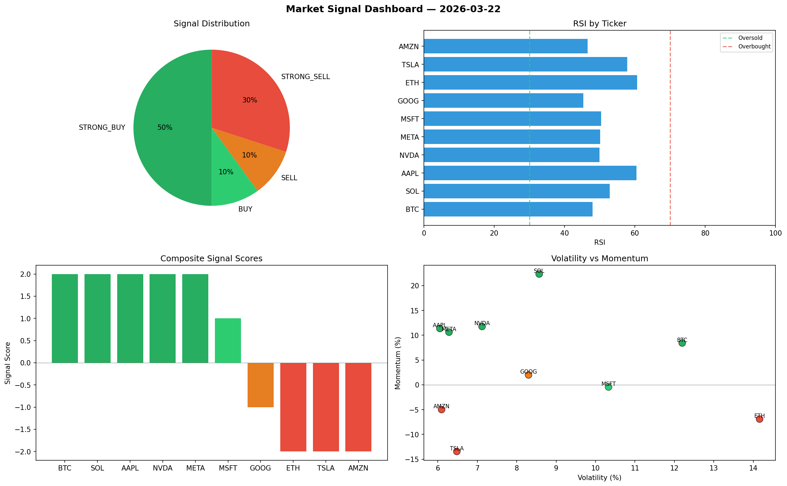

# Market Signal Report — 2026-03-22

**Run ID:** `88c5f72036` | **Buy:** 6 | **Sell:** 4 | **Hold:** 0

## Signal Dashboard

| Ticker | Price | Signal | Score | RSI | Momentum | Confidence |
|--------|-------|--------|-------|-----|----------|------------|
| BTC | $2891.46 | **STRONG_BUY** | 2 | 47.92 | 0.0843 | 0.5 |
| SOL | $3761.41 | **STRONG_BUY** | 2 | 52.88 | 0.2234 | 0.5 |
| AAPL | $853.95 | **STRONG_BUY** | 2 | 60.41 | 0.1136 | 0.5 |
| NVDA | $1852.18 | **STRONG_BUY** | 2 | 49.89 | 0.1176 | 0.5 |
| META | $5037.69 | **STRONG_BUY** | 2 | 50.15 | 0.1062 | 0.5 |
| MSFT | $4872.07 | **BUY** | 1 | 50.43 | -0.0044 | 0.25 |
| GOOG | $2322.01 | **SELL** | -1 | 45.32 | 0.0199 | 0.25 |
| ETH | $1289.09 | **STRONG_SELL** | -2 | 60.65 | -0.0691 | 0.5 |
| TSLA | $4652.16 | **STRONG_SELL** | -2 | 57.84 | -0.1344 | 0.5 |
| AMZN | $976.06 | **STRONG_SELL** | -2 | 46.54 | -0.0499 | 0.5 |

## Delta vs Yesterday

| Ticker | Today | Yesterday | Price Change | Signal Changed |
|--------|-------|-----------|-------------|----------------|
| BTC | STRONG_BUY | STRONG_SELL | 📉 -13.02% | ⚠️ YES |
| SOL | STRONG_BUY | STRONG_SELL | 📉 -16.54% | ⚠️ YES |
| AAPL | STRONG_BUY | HOLD | 📉 -78.26% | ⚠️ YES |
| NVDA | STRONG_BUY | BUY | 📉 -51.18% | ⚠️ YES |
| META | STRONG_BUY | HOLD | 📈 220.1% | ⚠️ YES |
| MSFT | BUY | STRONG_SELL | 📈 51.76% | ⚠️ YES |
| GOOG | SELL | STRONG_BUY | 📉 -56.42% | ⚠️ YES |
| ETH | STRONG_SELL | STRONG_BUY | 📉 -11.22% | ⚠️ YES |
| TSLA | STRONG_SELL | STRONG_SELL | 📈 19.32% | — |
| AMZN | STRONG_SELL | STRONG_SELL | 📉 -42.05% | — |