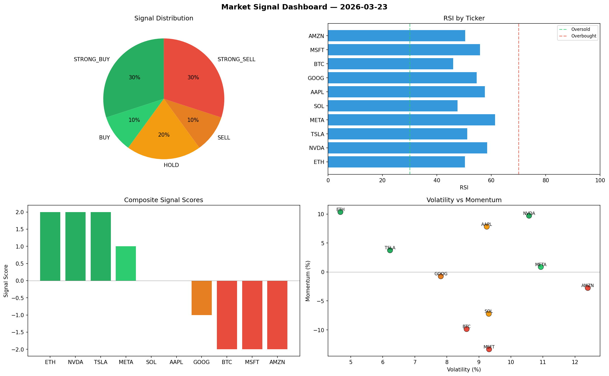

# Market Signal Report — 2026-03-23

**Run ID:** `370cbbc42b` | **Buy:** 4 | **Sell:** 4 | **Hold:** 2

## Signal Dashboard

| Ticker | Price | Signal | Score | RSI | Momentum | Confidence |
|--------|-------|--------|-------|-----|----------|------------|
| ETH | $1394.9 | **STRONG_BUY** | 2 | 50.3 | 0.1035 | 0.5 |
| NVDA | $2017.81 | **STRONG_BUY** | 2 | 58.43 | 0.0971 | 0.5 |
| TSLA | $898.24 | **STRONG_BUY** | 2 | 51.16 | 0.0374 | 0.5 |
| META | $4973.97 | **BUY** | 1 | 61.4 | 0.0086 | 0.25 |
| SOL | $1934.75 | **HOLD** | 0 | 47.6 | -0.0722 | 0.0 |
| AAPL | $3285.56 | **HOLD** | 0 | 57.62 | 0.0782 | 0.0 |
| GOOG | $4646.83 | **SELL** | -1 | 54.65 | -0.0075 | 0.25 |
| BTC | $3907.53 | **STRONG_SELL** | -2 | 45.99 | -0.0986 | 0.5 |
| MSFT | $1737.01 | **STRONG_SELL** | -2 | 55.84 | -0.1335 | 0.5 |
| AMZN | $1135.58 | **STRONG_SELL** | -2 | 50.42 | -0.0276 | 0.5 |

## Delta vs Yesterday

| Ticker | Today | Yesterday | Price Change | Signal Changed |
|--------|-------|-----------|-------------|----------------|
| ETH | STRONG_BUY | STRONG_SELL | 📈 8.21% | ⚠️ YES |
| NVDA | STRONG_BUY | STRONG_BUY | 📈 8.94% | — |
| TSLA | STRONG_BUY | STRONG_SELL | 📉 -80.69% | ⚠️ YES |
| META | BUY | STRONG_BUY | 📉 -1.26% | ⚠️ YES |
| SOL | HOLD | STRONG_BUY | 📉 -48.56% | ⚠️ YES |
| AAPL | HOLD | STRONG_BUY | 📈 284.75% | ⚠️ YES |
| GOOG | SELL | SELL | 📈 100.12% | — |
| BTC | STRONG_SELL | STRONG_BUY | 📈 35.14% | ⚠️ YES |
| MSFT | STRONG_SELL | BUY | 📉 -64.35% | ⚠️ YES |
| AMZN | STRONG_SELL | STRONG_SELL | 📈 16.34% | — |