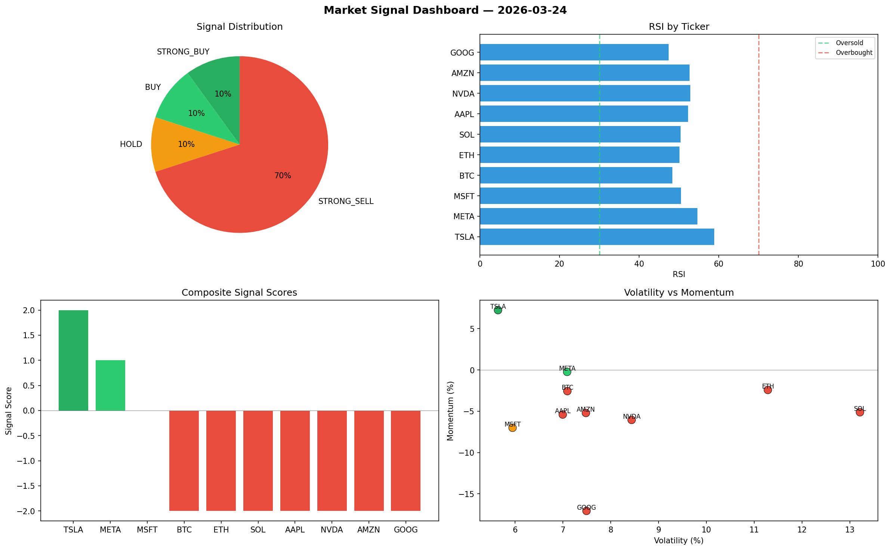

# Market Signal Report — 2026-03-24

**Run ID:** `4c644c81fc` | **Buy:** 2 | **Sell:** 7 | **Hold:** 1

## Signal Dashboard

| Ticker | Price | Signal | Score | RSI | Momentum | Confidence |
|--------|-------|--------|-------|-----|----------|------------|
| TSLA | $2988.27 | **STRONG_BUY** | 2 | 58.88 | 0.0725 | 0.5 |
| META | $1326.3 | **BUY** | 1 | 54.58 | -0.0023 | 0.25 |
| MSFT | $4993.23 | **HOLD** | 0 | 50.49 | -0.07 | 0.0 |
| BTC | $890.62 | **STRONG_SELL** | -2 | 48.35 | -0.0256 | 0.5 |
| ETH | $4146.13 | **STRONG_SELL** | -2 | 50.14 | -0.0242 | 0.5 |
| SOL | $412.41 | **STRONG_SELL** | -2 | 50.41 | -0.0512 | 0.5 |
| AAPL | $2232.37 | **STRONG_SELL** | -2 | 52.25 | -0.054 | 0.5 |
| NVDA | $289.64 | **STRONG_SELL** | -2 | 52.85 | -0.0605 | 0.5 |
| AMZN | $3062.88 | **STRONG_SELL** | -2 | 52.65 | -0.0521 | 0.5 |
| GOOG | $1186.68 | **STRONG_SELL** | -2 | 47.36 | -0.1707 | 0.5 |

## Delta vs Yesterday

| Ticker | Today | Yesterday | Price Change | Signal Changed |
|--------|-------|-----------|-------------|----------------|
| TSLA | STRONG_BUY | HOLD | 📉 -31.66% | ⚠️ YES |
| META | BUY | STRONG_BUY | 📉 -64.45% | ⚠️ YES |
| MSFT | HOLD | STRONG_BUY | 📈 79.88% | ⚠️ YES |
| BTC | STRONG_SELL | STRONG_BUY | 📉 -77.35% | ⚠️ YES |
| ETH | STRONG_SELL | HOLD | 📈 685.46% | ⚠️ YES |
| SOL | STRONG_SELL | SELL | 📉 -81.12% | ⚠️ YES |
| AAPL | STRONG_SELL | HOLD | 📉 -56.86% | ⚠️ YES |
| NVDA | STRONG_SELL | HOLD | 📉 -93.0% | ⚠️ YES |
| AMZN | STRONG_SELL | STRONG_SELL | 📉 -17.8% | — |
| GOOG | STRONG_SELL | HOLD | 📈 433.34% | ⚠️ YES |