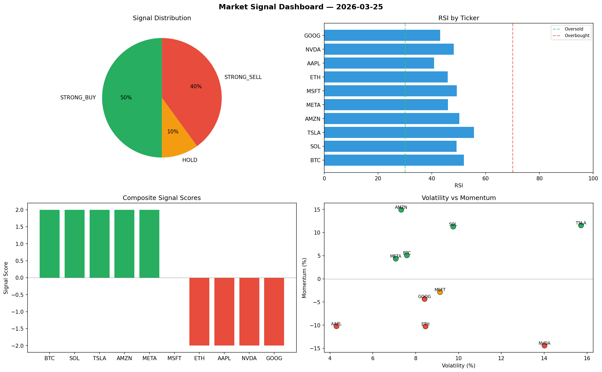

# Market Signal Report — 2026-03-25

**Run ID:** `b184c34e73` | **Buy:** 5 | **Sell:** 4 | **Hold:** 1

## Signal Dashboard

| Ticker | Price | Signal | Score | RSI | Momentum | Confidence |
|--------|-------|--------|-------|-----|----------|------------|
| BTC | $4655.62 | **STRONG_BUY** | 2 | 51.86 | 0.0507 | 0.5 |
| SOL | $1238.39 | **STRONG_BUY** | 2 | 49.16 | 0.1127 | 0.5 |
| TSLA | $1832.26 | **STRONG_BUY** | 2 | 55.67 | 0.1153 | 0.5 |
| AMZN | $637.21 | **STRONG_BUY** | 2 | 50.23 | 0.1491 | 0.5 |
| META | $2488.48 | **STRONG_BUY** | 2 | 46.0 | 0.0435 | 0.5 |
| MSFT | $364.64 | **HOLD** | 0 | 49.25 | -0.0287 | 0.0 |
| ETH | $2243.24 | **STRONG_SELL** | -2 | 45.86 | -0.1027 | 0.5 |
| AAPL | $1664.85 | **STRONG_SELL** | -2 | 40.81 | -0.1023 | 0.5 |
| NVDA | $4754.87 | **STRONG_SELL** | -2 | 48.1 | -0.1441 | 0.5 |
| GOOG | $337.5 | **STRONG_SELL** | -2 | 43.06 | -0.0435 | 0.5 |

## Delta vs Yesterday

| Ticker | Today | Yesterday | Price Change | Signal Changed |
|--------|-------|-----------|-------------|----------------|
| BTC | STRONG_BUY | STRONG_SELL | 📈 422.74% | ⚠️ YES |
| SOL | STRONG_BUY | STRONG_SELL | 📈 200.28% | ⚠️ YES |
| TSLA | STRONG_BUY | STRONG_BUY | 📉 -38.68% | — |
| AMZN | STRONG_BUY | STRONG_SELL | 📉 -79.2% | ⚠️ YES |
| META | STRONG_BUY | BUY | 📈 87.63% | ⚠️ YES |
| MSFT | HOLD | HOLD | 📉 -92.7% | — |
| ETH | STRONG_SELL | STRONG_SELL | 📉 -45.9% | — |
| AAPL | STRONG_SELL | STRONG_SELL | 📉 -25.42% | — |
| NVDA | STRONG_SELL | STRONG_SELL | 📈 1541.65% | — |
| GOOG | STRONG_SELL | STRONG_SELL | 📉 -71.56% | — |