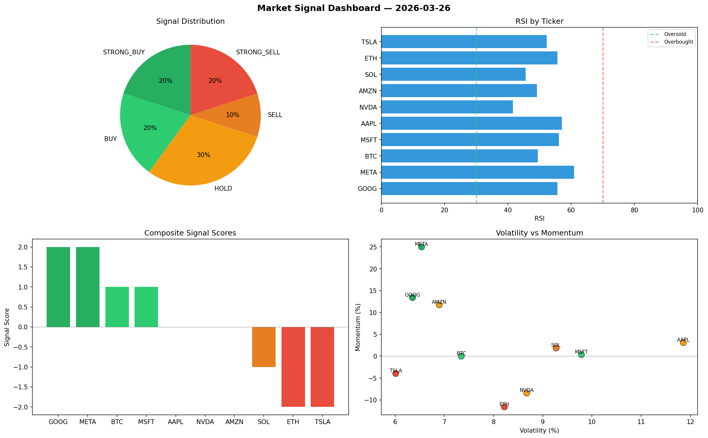

# Market Signal Report — 2026-03-26

**Run ID:** `19998ac41b` | **Buy:** 4 | **Sell:** 3 | **Hold:** 3

## Signal Dashboard

| Ticker | Price | Signal | Score | RSI | Momentum | Confidence |
|--------|-------|--------|-------|-----|----------|------------|
| GOOG | $4935.43 | **STRONG_BUY** | 2 | 55.68 | 0.1341 | 0.5 |
| META | $4586.23 | **STRONG_BUY** | 2 | 60.9 | 0.2498 | 0.5 |
| BTC | $248.08 | **BUY** | 1 | 49.5 | 0.0001 | 0.25 |
| MSFT | $654.28 | **BUY** | 1 | 56.09 | 0.0035 | 0.25 |
| AAPL | $199.81 | **HOLD** | 0 | 57.04 | 0.0311 | 0.0 |
| NVDA | $691.75 | **HOLD** | 0 | 41.54 | -0.0844 | 0.0 |
| AMZN | $2576.17 | **HOLD** | 0 | 49.21 | 0.1174 | 0.0 |
| SOL | $3944.85 | **SELL** | -1 | 45.59 | 0.0187 | 0.25 |
| ETH | $3472.07 | **STRONG_SELL** | -2 | 55.67 | -0.1159 | 0.5 |
| TSLA | $4658.54 | **STRONG_SELL** | -2 | 52.3 | -0.0396 | 0.5 |

## Delta vs Yesterday

| Ticker | Today | Yesterday | Price Change | Signal Changed |
|--------|-------|-----------|-------------|----------------|
| GOOG | STRONG_BUY | STRONG_SELL | 📈 1362.35% | ⚠️ YES |
| META | STRONG_BUY | STRONG_BUY | 📈 84.3% | — |
| BTC | BUY | STRONG_BUY | 📉 -94.67% | ⚠️ YES |
| MSFT | BUY | HOLD | 📈 79.43% | ⚠️ YES |
| AAPL | HOLD | STRONG_SELL | 📉 -88.0% | ⚠️ YES |
| NVDA | HOLD | STRONG_SELL | 📉 -85.45% | ⚠️ YES |
| AMZN | HOLD | STRONG_BUY | 📈 304.29% | ⚠️ YES |
| SOL | SELL | STRONG_BUY | 📈 218.55% | ⚠️ YES |
| ETH | STRONG_SELL | STRONG_SELL | 📈 54.78% | — |
| TSLA | STRONG_SELL | STRONG_BUY | 📈 154.25% | ⚠️ YES |