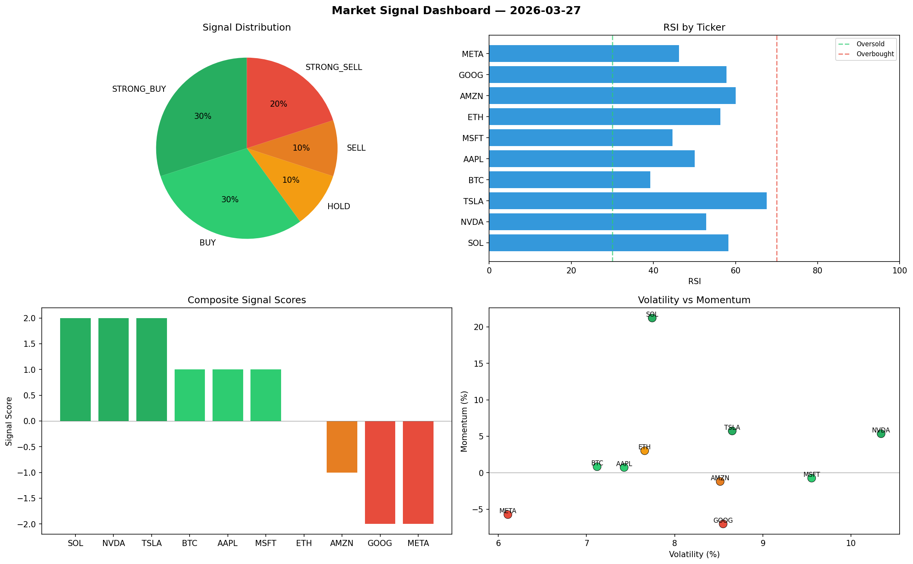

# Market Signal Report — 2026-03-27

**Run ID:** `92ae0e0aba` | **Buy:** 6 | **Sell:** 3 | **Hold:** 1

## Signal Dashboard

| Ticker | Price | Signal | Score | RSI | Momentum | Confidence |
|--------|-------|--------|-------|-----|----------|------------|
| SOL | $2403.8 | **STRONG_BUY** | 2 | 58.28 | 0.2122 | 0.5 |
| NVDA | $4369.3 | **STRONG_BUY** | 2 | 52.81 | 0.0535 | 0.5 |
| TSLA | $4648.0 | **STRONG_BUY** | 2 | 67.62 | 0.0573 | 0.5 |
| BTC | $4013.92 | **BUY** | 1 | 39.26 | 0.0083 | 0.25 |
| AAPL | $3229.66 | **BUY** | 1 | 50.04 | 0.0072 | 0.25 |
| MSFT | $3360.69 | **BUY** | 1 | 44.67 | -0.0074 | 0.25 |
| ETH | $3785.74 | **HOLD** | 0 | 56.29 | 0.0302 | 0.0 |
| AMZN | $162.55 | **SELL** | -1 | 60.06 | -0.012 | 0.25 |
| GOOG | $1417.45 | **STRONG_SELL** | -2 | 57.82 | -0.0702 | 0.5 |
| META | $4292.26 | **STRONG_SELL** | -2 | 46.19 | -0.0574 | 0.5 |

## Delta vs Yesterday

| Ticker | Today | Yesterday | Price Change | Signal Changed |
|--------|-------|-----------|-------------|----------------|
| SOL | STRONG_BUY | STRONG_SELL | 📉 -30.5% | ⚠️ YES |
| NVDA | STRONG_BUY | HOLD | 📉 -7.28% | ⚠️ YES |
| TSLA | STRONG_BUY | HOLD | 📈 44.49% | ⚠️ YES |
| BTC | BUY | HOLD | 📉 -16.3% | ⚠️ YES |
| AAPL | BUY | SELL | 📉 -26.67% | ⚠️ YES |
| MSFT | BUY | STRONG_BUY | 📈 29.66% | ⚠️ YES |
| ETH | HOLD | HOLD | 📈 12.12% | — |
| AMZN | SELL | STRONG_BUY | 📉 -92.26% | ⚠️ YES |
| GOOG | STRONG_SELL | STRONG_SELL | 📉 -62.1% | — |
| META | STRONG_SELL | HOLD | 📈 7774.26% | ⚠️ YES |