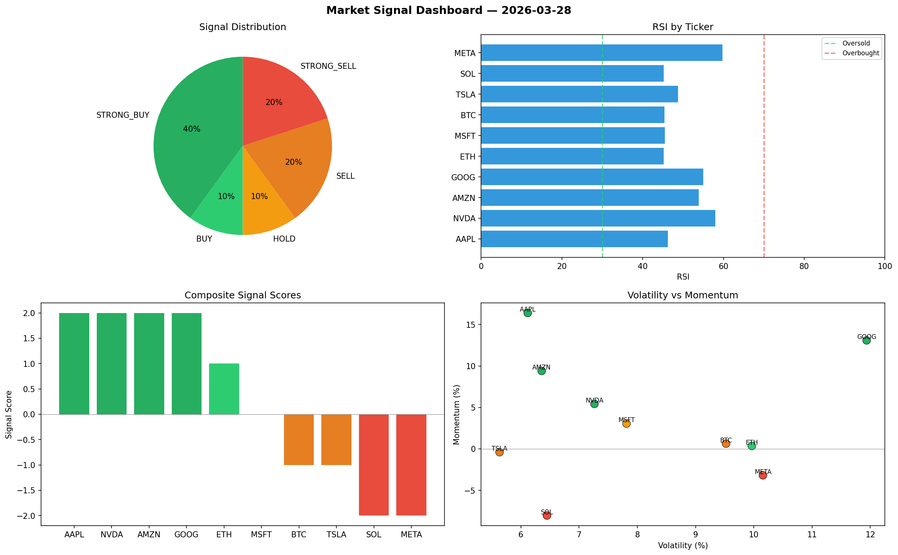

# Market Signal Report — 2026-03-28

**Run ID:** `d121d8278a` | **Buy:** 5 | **Sell:** 4 | **Hold:** 1

## Signal Dashboard

| Ticker | Price | Signal | Score | RSI | Momentum | Confidence |
|--------|-------|--------|-------|-----|----------|------------|
| AAPL | $3118.21 | **STRONG_BUY** | 2 | 46.27 | 0.1639 | 0.5 |
| NVDA | $2809.66 | **STRONG_BUY** | 2 | 57.96 | 0.0542 | 0.5 |
| AMZN | $1819.05 | **STRONG_BUY** | 2 | 53.92 | 0.094 | 0.5 |
| GOOG | $4208.46 | **STRONG_BUY** | 2 | 55.03 | 0.1308 | 0.5 |
| ETH | $2444.73 | **BUY** | 1 | 45.22 | 0.0035 | 0.25 |
| MSFT | $1629.32 | **HOLD** | 0 | 45.45 | 0.0305 | 0.0 |
| BTC | $3872.78 | **SELL** | -1 | 45.35 | 0.0063 | 0.25 |
| TSLA | $1651.88 | **SELL** | -1 | 48.78 | -0.004 | 0.25 |
| SOL | $2976.78 | **STRONG_SELL** | -2 | 45.16 | -0.0804 | 0.5 |
| META | $258.79 | **STRONG_SELL** | -2 | 59.75 | -0.0319 | 0.5 |

## Delta vs Yesterday

| Ticker | Today | Yesterday | Price Change | Signal Changed |
|--------|-------|-----------|-------------|----------------|
| AAPL | STRONG_BUY | STRONG_BUY | 📈 679.57% | — |
| NVDA | STRONG_BUY | STRONG_SELL | 📉 -19.82% | ⚠️ YES |
| AMZN | STRONG_BUY | STRONG_BUY | 📉 -65.5% | — |
| GOOG | STRONG_BUY | STRONG_BUY | 📈 71.29% | — |
| ETH | BUY | STRONG_SELL | 📈 332.23% | ⚠️ YES |
| MSFT | HOLD | STRONG_BUY | 📉 -34.24% | ⚠️ YES |
| BTC | SELL | HOLD | 📈 1261.4% | ⚠️ YES |
| TSLA | SELL | SELL | 📉 -53.18% | — |
| SOL | STRONG_SELL | SELL | 📈 92.7% | ⚠️ YES |
| META | STRONG_SELL | BUY | 📉 -76.72% | ⚠️ YES |