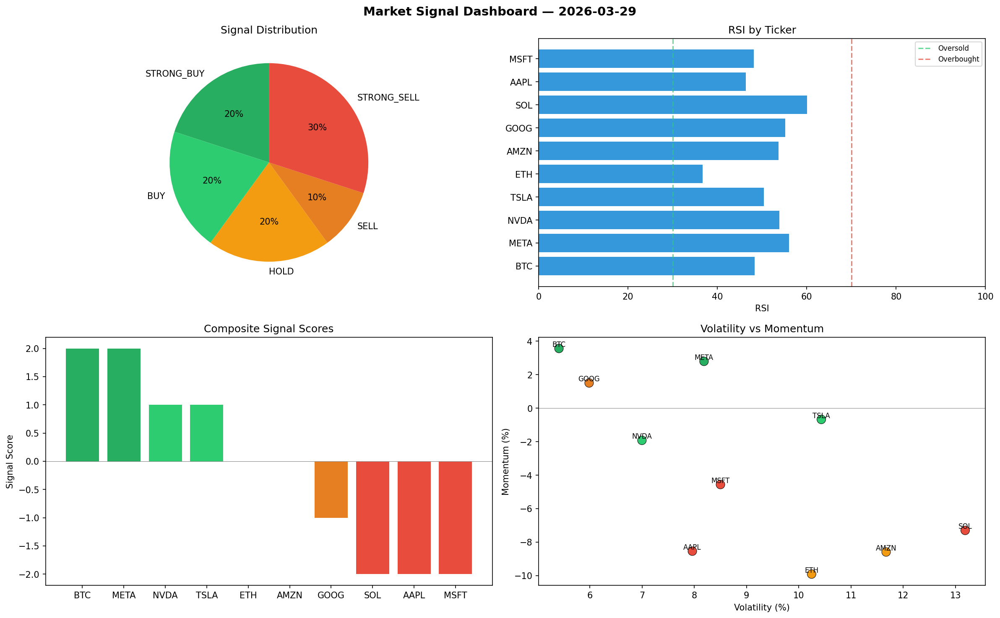

# Market Signal Report — 2026-03-29

**Run ID:** `24650bed4a` | **Buy:** 4 | **Sell:** 4 | **Hold:** 2

## Signal Dashboard

| Ticker | Price | Signal | Score | RSI | Momentum | Confidence |
|--------|-------|--------|-------|-----|----------|------------|
| BTC | $765.34 | **STRONG_BUY** | 2 | 48.33 | 0.0357 | 0.5 |
| META | $2632.75 | **STRONG_BUY** | 2 | 56.05 | 0.028 | 0.5 |
| NVDA | $1337.16 | **BUY** | 1 | 53.86 | -0.0192 | 0.25 |
| TSLA | $487.64 | **BUY** | 1 | 50.38 | -0.0067 | 0.25 |
| ETH | $1271.97 | **HOLD** | 0 | 36.66 | -0.0991 | 0.0 |
| AMZN | $674.84 | **HOLD** | 0 | 53.68 | -0.0859 | 0.0 |
| GOOG | $133.96 | **SELL** | -1 | 55.19 | 0.0151 | 0.25 |
| SOL | $2201.79 | **STRONG_SELL** | -2 | 60.05 | -0.073 | 0.5 |
| AAPL | $2887.17 | **STRONG_SELL** | -2 | 46.32 | -0.0854 | 0.5 |
| MSFT | $931.07 | **STRONG_SELL** | -2 | 48.19 | -0.0456 | 0.5 |

## Delta vs Yesterday

| Ticker | Today | Yesterday | Price Change | Signal Changed |
|--------|-------|-----------|-------------|----------------|
| BTC | STRONG_BUY | STRONG_BUY | 📉 -54.03% | — |
| META | STRONG_BUY | SELL | 📈 1254.36% | ⚠️ YES |
| NVDA | BUY | SELL | 📉 -53.47% | ⚠️ YES |
| TSLA | BUY | SELL | 📉 -48.78% | ⚠️ YES |
| ETH | HOLD | HOLD | 📉 -26.91% | — |
| AMZN | HOLD | STRONG_SELL | 📉 -73.61% | ⚠️ YES |
| GOOG | SELL | BUY | 📉 -75.23% | ⚠️ YES |
| SOL | STRONG_SELL | HOLD | 📈 3.05% | ⚠️ YES |
| AAPL | STRONG_SELL | HOLD | 📉 -8.07% | ⚠️ YES |
| MSFT | STRONG_SELL | BUY | 📉 -76.69% | ⚠️ YES |