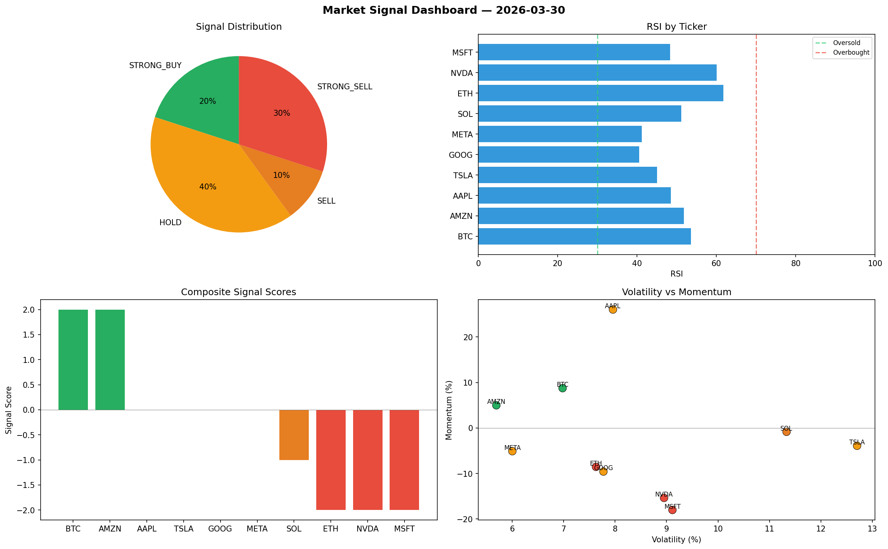

# Market Signal Report — 2026-03-30

**Run ID:** `a1ed78d594` | **Buy:** 2 | **Sell:** 4 | **Hold:** 4

## Signal Dashboard

| Ticker | Price | Signal | Score | RSI | Momentum | Confidence |
|--------|-------|--------|-------|-----|----------|------------|
| BTC | $1215.99 | **STRONG_BUY** | 2 | 53.62 | 0.0875 | 0.5 |
| AMZN | $2998.85 | **STRONG_BUY** | 2 | 51.78 | 0.0498 | 0.5 |
| AAPL | $4488.57 | **HOLD** | 0 | 48.53 | 0.2602 | 0.0 |
| TSLA | $3495.81 | **HOLD** | 0 | 45.08 | -0.0391 | 0.0 |
| GOOG | $1202.85 | **HOLD** | 0 | 40.51 | -0.0957 | 0.0 |
| META | $669.95 | **HOLD** | 0 | 41.23 | -0.051 | 0.0 |
| SOL | $3635.0 | **SELL** | -1 | 51.18 | -0.0084 | 0.25 |
| ETH | $76.85 | **STRONG_SELL** | -2 | 61.8 | -0.0854 | 0.5 |
| NVDA | $184.85 | **STRONG_SELL** | -2 | 60.03 | -0.1536 | 0.5 |
| MSFT | $3690.87 | **STRONG_SELL** | -2 | 48.31 | -0.1801 | 0.5 |

## Delta vs Yesterday

| Ticker | Today | Yesterday | Price Change | Signal Changed |
|--------|-------|-----------|-------------|----------------|
| BTC | STRONG_BUY | STRONG_SELL | 📉 -0.82% | ⚠️ YES |
| AMZN | STRONG_BUY | BUY | 📈 176.66% | ⚠️ YES |
| AAPL | HOLD | STRONG_SELL | 📈 5296.21% | ⚠️ YES |
| TSLA | HOLD | STRONG_BUY | 📈 13.17% | ⚠️ YES |
| GOOG | HOLD | STRONG_SELL | 📉 -63.63% | ⚠️ YES |
| META | HOLD | STRONG_BUY | 📉 -68.05% | ⚠️ YES |
| SOL | SELL | STRONG_BUY | 📈 47.88% | ⚠️ YES |
| ETH | STRONG_SELL | STRONG_BUY | 📉 -56.91% | ⚠️ YES |
| NVDA | STRONG_SELL | STRONG_SELL | 📉 -92.17% | — |
| MSFT | STRONG_SELL | SELL | 📈 2.74% | ⚠️ YES |