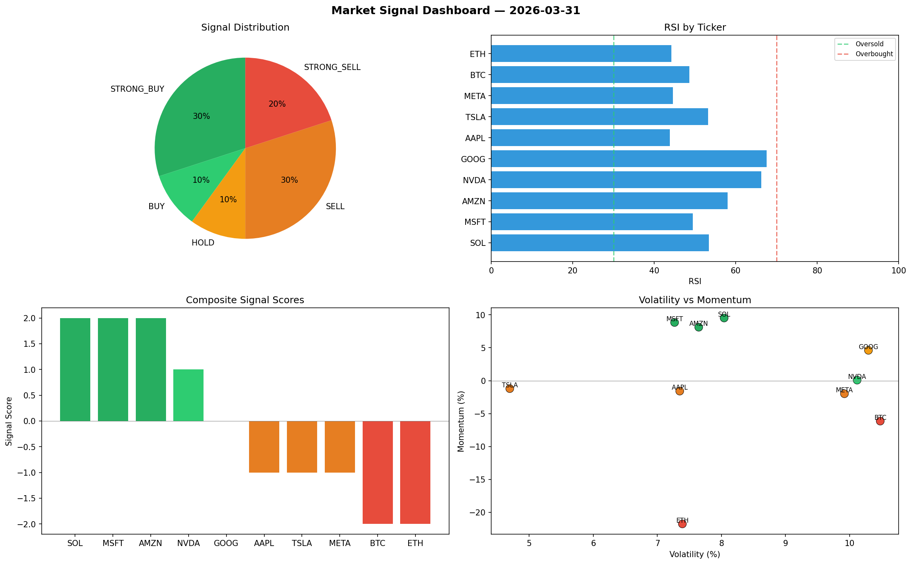

# Market Signal Report — 2026-03-31

**Run ID:** `7e0c954d5f` | **Buy:** 4 | **Sell:** 5 | **Hold:** 1

## Signal Dashboard

| Ticker | Price | Signal | Score | RSI | Momentum | Confidence |
|--------|-------|--------|-------|-----|----------|------------|
| SOL | $5450.66 | **STRONG_BUY** | 2 | 53.41 | 0.0952 | 0.5 |
| MSFT | $919.82 | **STRONG_BUY** | 2 | 49.46 | 0.0884 | 0.5 |
| AMZN | $3154.47 | **STRONG_BUY** | 2 | 57.98 | 0.0812 | 0.5 |
| NVDA | $1783.75 | **BUY** | 1 | 66.22 | 0.0008 | 0.25 |
| GOOG | $1620.73 | **HOLD** | 0 | 67.54 | 0.0461 | 0.0 |
| AAPL | $1287.31 | **SELL** | -1 | 43.81 | -0.0159 | 0.25 |
| TSLA | $4019.51 | **SELL** | -1 | 53.2 | -0.0121 | 0.25 |
| META | $189.8 | **SELL** | -1 | 44.54 | -0.0199 | 0.25 |
| BTC | $4051.01 | **STRONG_SELL** | -2 | 48.66 | -0.0615 | 0.5 |
| ETH | $3941.35 | **STRONG_SELL** | -2 | 44.22 | -0.2177 | 0.5 |

## Delta vs Yesterday

| Ticker | Today | Yesterday | Price Change | Signal Changed |
|--------|-------|-----------|-------------|----------------|
| SOL | STRONG_BUY | HOLD | 📈 235.46% | ⚠️ YES |
| MSFT | STRONG_BUY | STRONG_SELL | 📈 3.54% | ⚠️ YES |
| AMZN | STRONG_BUY | STRONG_BUY | 📈 233.88% | — |
| NVDA | BUY | SELL | 📈 56.53% | ⚠️ YES |
| GOOG | HOLD | STRONG_BUY | 📈 92.81% | ⚠️ YES |
| AAPL | SELL | HOLD | 📈 196.27% | ⚠️ YES |
| TSLA | SELL | STRONG_SELL | 📈 258.57% | ⚠️ YES |
| META | SELL | STRONG_SELL | 📉 -73.4% | ⚠️ YES |
| BTC | STRONG_SELL | STRONG_SELL | 📈 246.67% | — |
| ETH | STRONG_SELL | BUY | 📈 74.46% | ⚠️ YES |