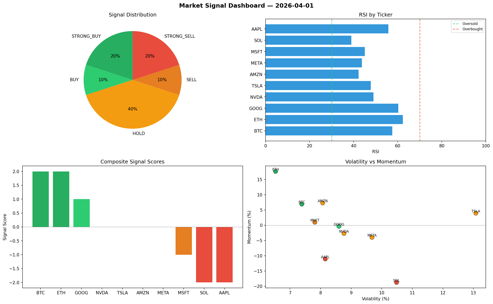

# Market Signal Report — 2026-04-01

**Run ID:** `f67dca4644` | **Buy:** 3 | **Sell:** 3 | **Hold:** 4

## Signal Dashboard

| Ticker | Price | Signal | Score | RSI | Momentum | Confidence |
|--------|-------|--------|-------|-----|----------|------------|
| BTC | $4066.03 | **STRONG_BUY** | 2 | 57.49 | 0.069 | 0.5 |
| ETH | $4449.32 | **STRONG_BUY** | 2 | 62.3 | 0.1763 | 0.5 |
| GOOG | $2085.73 | **BUY** | 1 | 60.26 | -0.0039 | 0.25 |
| NVDA | $711.23 | **HOLD** | 0 | 48.98 | -0.0272 | 0.0 |
| TSLA | $4429.76 | **HOLD** | 0 | 47.75 | 0.0393 | 0.0 |
| AMZN | $5028.17 | **HOLD** | 0 | 42.22 | 0.0728 | 0.0 |
| META | $1300.65 | **HOLD** | 0 | 43.72 | -0.04 | 0.0 |
| MSFT | $2940.62 | **SELL** | -1 | 45.05 | 0.0097 | 0.25 |
| SOL | $324.25 | **STRONG_SELL** | -2 | 38.97 | -0.1876 | 0.5 |
| AAPL | $102.77 | **STRONG_SELL** | -2 | 55.79 | -0.1108 | 0.5 |

## Delta vs Yesterday

| Ticker | Today | Yesterday | Price Change | Signal Changed |
|--------|-------|-----------|-------------|----------------|
| BTC | STRONG_BUY | HOLD | 📉 -13.04% | ⚠️ YES |
| ETH | STRONG_BUY | STRONG_SELL | 📈 3.24% | ⚠️ YES |
| GOOG | BUY | HOLD | 📈 215.42% | ⚠️ YES |
| NVDA | HOLD | HOLD | 📉 -72.96% | — |
| TSLA | HOLD | STRONG_BUY | 📈 37.73% | ⚠️ YES |
| AMZN | HOLD | SELL | 📈 115.18% | ⚠️ YES |
| META | HOLD | BUY | 📉 -72.08% | ⚠️ YES |
| MSFT | SELL | BUY | 📉 -22.63% | ⚠️ YES |
| SOL | STRONG_SELL | STRONG_BUY | 📉 -84.71% | ⚠️ YES |
| AAPL | STRONG_SELL | SELL | 📉 -97.66% | ⚠️ YES |