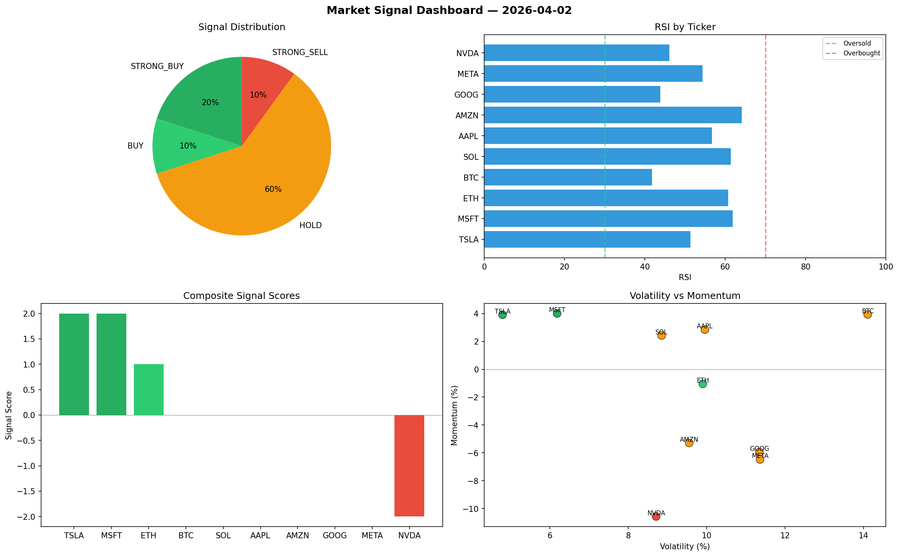

# Market Signal Report — 2026-04-02

**Run ID:** `a3408f09d9` | **Buy:** 3 | **Sell:** 1 | **Hold:** 6

## Signal Dashboard

| Ticker | Price | Signal | Score | RSI | Momentum | Confidence |
|--------|-------|--------|-------|-----|----------|------------|
| TSLA | $5143.09 | **STRONG_BUY** | 2 | 51.32 | 0.0391 | 0.5 |
| MSFT | $1726.66 | **STRONG_BUY** | 2 | 61.81 | 0.04 | 0.5 |
| ETH | $4463.78 | **BUY** | 1 | 60.68 | -0.0105 | 0.25 |
| BTC | $4467.56 | **HOLD** | 0 | 41.8 | 0.0393 | 0.0 |
| SOL | $1286.52 | **HOLD** | 0 | 61.38 | 0.0242 | 0.0 |
| AAPL | $3087.06 | **HOLD** | 0 | 56.65 | 0.0284 | 0.0 |
| AMZN | $4516.16 | **HOLD** | 0 | 64.08 | -0.0529 | 0.0 |
| GOOG | $1737.45 | **HOLD** | 0 | 43.83 | -0.0595 | 0.0 |
| META | $1420.8 | **HOLD** | 0 | 54.37 | -0.0648 | 0.0 |
| NVDA | $2881.41 | **STRONG_SELL** | -2 | 46.07 | -0.1057 | 0.5 |

## Delta vs Yesterday

| Ticker | Today | Yesterday | Price Change | Signal Changed |
|--------|-------|-----------|-------------|----------------|
| TSLA | STRONG_BUY | BUY | 📈 70.17% | ⚠️ YES |
| MSFT | STRONG_BUY | HOLD | 📈 15.33% | ⚠️ YES |
| ETH | BUY | HOLD | 📈 201.35% | ⚠️ YES |
| BTC | HOLD | SELL | 📈 85.44% | ⚠️ YES |
| SOL | HOLD | STRONG_SELL | 📈 50.79% | ⚠️ YES |
| AAPL | HOLD | SELL | 📈 141.2% | ⚠️ YES |
| AMZN | HOLD | HOLD | 📈 347.45% | — |
| GOOG | HOLD | STRONG_BUY | 📉 -60.2% | ⚠️ YES |
| META | HOLD | STRONG_SELL | 📉 -45.6% | ⚠️ YES |
| NVDA | STRONG_SELL | STRONG_SELL | 📉 -24.25% | — |