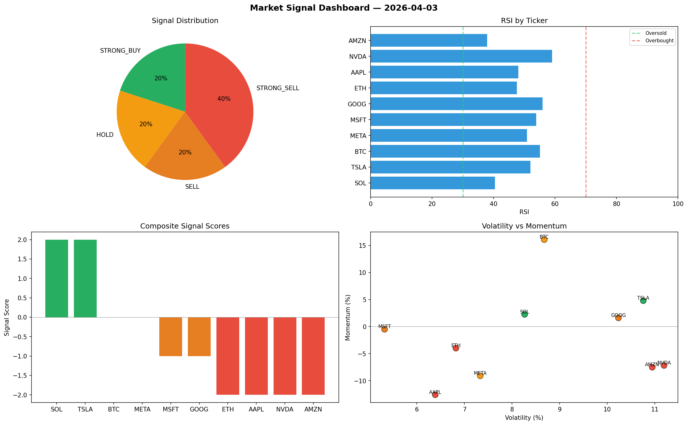

# Market Signal Report — 2026-04-03

**Run ID:** `8479a7962a` | **Buy:** 2 | **Sell:** 6 | **Hold:** 2

## Signal Dashboard

| Ticker | Price | Signal | Score | RSI | Momentum | Confidence |
|--------|-------|--------|-------|-----|----------|------------|
| SOL | $157.55 | **STRONG_BUY** | 2 | 40.41 | 0.0225 | 0.5 |
| TSLA | $4683.84 | **STRONG_BUY** | 2 | 51.98 | 0.0479 | 0.5 |
| BTC | $2593.4 | **HOLD** | 0 | 55.09 | 0.1608 | 0.0 |
| META | $186.92 | **HOLD** | 0 | 50.85 | -0.0911 | 0.0 |
| MSFT | $2122.28 | **SELL** | -1 | 53.89 | -0.005 | 0.25 |
| GOOG | $2948.39 | **SELL** | -1 | 55.97 | 0.0161 | 0.25 |
| ETH | $606.24 | **STRONG_SELL** | -2 | 47.6 | -0.0399 | 0.5 |
| AAPL | $2678.15 | **STRONG_SELL** | -2 | 48.04 | -0.1261 | 0.5 |
| NVDA | $2232.49 | **STRONG_SELL** | -2 | 59.08 | -0.0719 | 0.5 |
| AMZN | $1302.5 | **STRONG_SELL** | -2 | 37.94 | -0.0752 | 0.5 |

## Delta vs Yesterday

| Ticker | Today | Yesterday | Price Change | Signal Changed |
|--------|-------|-----------|-------------|----------------|
| SOL | STRONG_BUY | STRONG_SELL | 📉 -65.09% | ⚠️ YES |
| TSLA | STRONG_BUY | STRONG_SELL | 📈 141.12% | ⚠️ YES |
| BTC | HOLD | HOLD | 📈 20.03% | — |
| META | HOLD | STRONG_SELL | 📉 -93.17% | ⚠️ YES |
| MSFT | SELL | STRONG_BUY | 📉 -42.51% | ⚠️ YES |
| GOOG | SELL | STRONG_SELL | 📉 -35.74% | ⚠️ YES |
| ETH | STRONG_SELL | STRONG_BUY | 📉 -8.63% | ⚠️ YES |
| AAPL | STRONG_SELL | STRONG_SELL | 📈 46.21% | — |
| NVDA | STRONG_SELL | HOLD | 📉 -30.11% | ⚠️ YES |
| AMZN | STRONG_SELL | STRONG_SELL | 📈 70.84% | — |