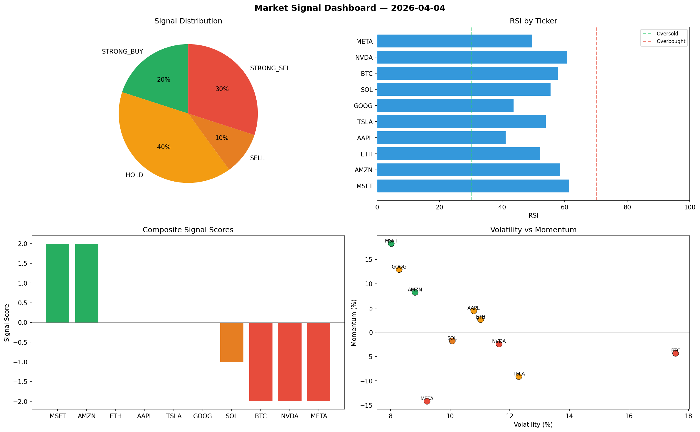

# Market Signal Report — 2026-04-04

**Run ID:** `236505f346` | **Buy:** 2 | **Sell:** 4 | **Hold:** 4

## Signal Dashboard

| Ticker | Price | Signal | Score | RSI | Momentum | Confidence |
|--------|-------|--------|-------|-----|----------|------------|
| MSFT | $5225.2 | **STRONG_BUY** | 2 | 61.48 | 0.1826 | 0.5 |
| AMZN | $3326.45 | **STRONG_BUY** | 2 | 58.33 | 0.0821 | 0.5 |
| ETH | $2724.44 | **HOLD** | 0 | 52.17 | 0.0261 | 0.0 |
| AAPL | $4440.98 | **HOLD** | 0 | 41.15 | 0.0442 | 0.0 |
| TSLA | $4699.99 | **HOLD** | 0 | 53.92 | -0.0912 | 0.0 |
| GOOG | $2171.45 | **HOLD** | 0 | 43.63 | 0.1292 | 0.0 |
| SOL | $2043.94 | **SELL** | -1 | 55.46 | -0.0178 | 0.25 |
| BTC | $4811.46 | **STRONG_SELL** | -2 | 57.86 | -0.0434 | 0.5 |
| NVDA | $2214.36 | **STRONG_SELL** | -2 | 60.7 | -0.0244 | 0.5 |
| META | $500.22 | **STRONG_SELL** | -2 | 49.56 | -0.1421 | 0.5 |

## Delta vs Yesterday

| Ticker | Today | Yesterday | Price Change | Signal Changed |
|--------|-------|-----------|-------------|----------------|
| MSFT | STRONG_BUY | SELL | 📈 146.21% | ⚠️ YES |
| AMZN | STRONG_BUY | STRONG_SELL | 📈 155.39% | ⚠️ YES |
| ETH | HOLD | STRONG_SELL | 📈 349.4% | ⚠️ YES |
| AAPL | HOLD | STRONG_SELL | 📈 65.82% | ⚠️ YES |
| TSLA | HOLD | STRONG_BUY | 📈 0.34% | ⚠️ YES |
| GOOG | HOLD | SELL | 📉 -26.35% | ⚠️ YES |
| SOL | SELL | STRONG_BUY | 📈 1197.33% | ⚠️ YES |
| BTC | STRONG_SELL | HOLD | 📈 85.53% | ⚠️ YES |
| NVDA | STRONG_SELL | STRONG_SELL | 📉 -0.81% | — |
| META | STRONG_SELL | HOLD | 📈 167.61% | ⚠️ YES |