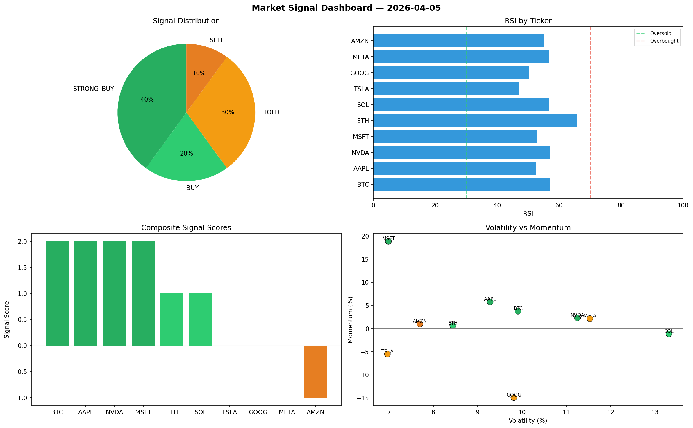

# Market Signal Report — 2026-04-05

**Run ID:** `f25a64f45d` | **Buy:** 6 | **Sell:** 1 | **Hold:** 3

## Signal Dashboard

| Ticker | Price | Signal | Score | RSI | Momentum | Confidence |
|--------|-------|--------|-------|-----|----------|------------|
| BTC | $1536.11 | **STRONG_BUY** | 2 | 56.94 | 0.0374 | 0.5 |
| AAPL | $2736.53 | **STRONG_BUY** | 2 | 52.59 | 0.0576 | 0.5 |
| NVDA | $1860.87 | **STRONG_BUY** | 2 | 56.93 | 0.023 | 0.5 |
| MSFT | $3213.99 | **STRONG_BUY** | 2 | 52.82 | 0.1885 | 0.5 |
| ETH | $4247.03 | **BUY** | 1 | 65.78 | 0.0064 | 0.25 |
| SOL | $2015.47 | **BUY** | 1 | 56.71 | -0.0114 | 0.25 |
| TSLA | $4659.66 | **HOLD** | 0 | 46.93 | -0.0551 | 0.0 |
| GOOG | $364.18 | **HOLD** | 0 | 50.38 | -0.1491 | 0.0 |
| META | $287.16 | **HOLD** | 0 | 56.86 | 0.0216 | 0.0 |
| AMZN | $2103.54 | **SELL** | -1 | 55.26 | 0.0097 | 0.25 |

## Delta vs Yesterday

| Ticker | Today | Yesterday | Price Change | Signal Changed |
|--------|-------|-----------|-------------|----------------|
| BTC | STRONG_BUY | STRONG_SELL | 📉 -47.45% | ⚠️ YES |
| AAPL | STRONG_BUY | STRONG_BUY | 📈 31.69% | — |
| NVDA | STRONG_BUY | STRONG_BUY | 📉 -54.56% | — |
| MSFT | STRONG_BUY | SELL | 📈 2.34% | ⚠️ YES |
| ETH | BUY | SELL | 📈 1.06% | ⚠️ YES |
| SOL | BUY | STRONG_BUY | 📉 -60.86% | ⚠️ YES |
| TSLA | HOLD | STRONG_BUY | 📈 35.36% | ⚠️ YES |
| GOOG | HOLD | BUY | 📉 -80.27% | ⚠️ YES |
| META | HOLD | BUY | 📉 -89.8% | ⚠️ YES |
| AMZN | SELL | BUY | 📉 -41.91% | ⚠️ YES |