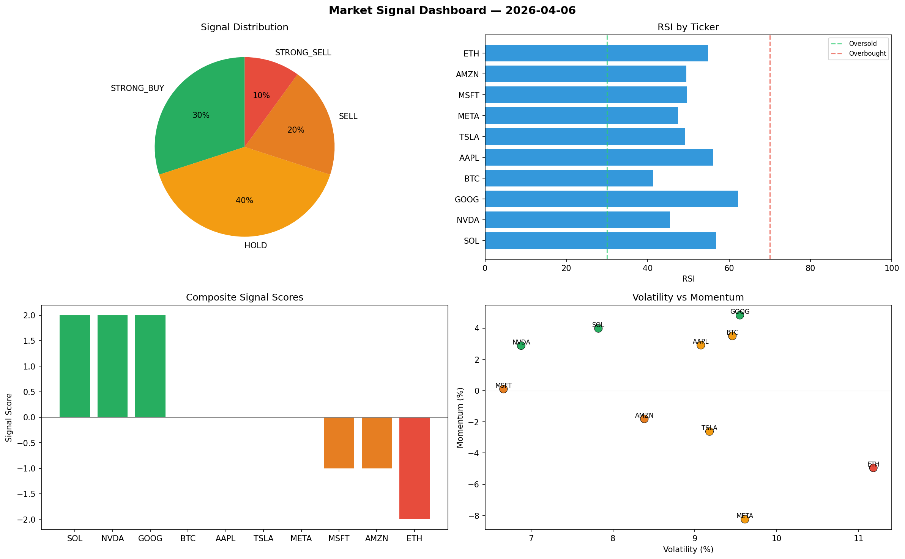

# Market Signal Report — 2026-04-06

**Run ID:** `e4b65cabd1` | **Buy:** 3 | **Sell:** 3 | **Hold:** 4

## Signal Dashboard

| Ticker | Price | Signal | Score | RSI | Momentum | Confidence |
|--------|-------|--------|-------|-----|----------|------------|
| SOL | $4110.48 | **STRONG_BUY** | 2 | 56.77 | 0.0398 | 0.5 |
| NVDA | $1549.41 | **STRONG_BUY** | 2 | 45.47 | 0.0288 | 0.5 |
| GOOG | $2450.54 | **STRONG_BUY** | 2 | 62.18 | 0.0483 | 0.5 |
| BTC | $5042.0 | **HOLD** | 0 | 41.25 | 0.035 | 0.0 |
| AAPL | $3818.39 | **HOLD** | 0 | 56.1 | 0.0291 | 0.0 |
| TSLA | $1783.66 | **HOLD** | 0 | 49.13 | -0.0262 | 0.0 |
| META | $1652.04 | **HOLD** | 0 | 47.4 | -0.0824 | 0.0 |
| MSFT | $1433.62 | **SELL** | -1 | 49.69 | 0.001 | 0.25 |
| AMZN | $285.76 | **SELL** | -1 | 49.46 | -0.0181 | 0.25 |
| ETH | $1469.97 | **STRONG_SELL** | -2 | 54.81 | -0.0495 | 0.5 |

## Delta vs Yesterday

| Ticker | Today | Yesterday | Price Change | Signal Changed |
|--------|-------|-----------|-------------|----------------|
| SOL | STRONG_BUY | STRONG_SELL | 📈 6511.68% | ⚠️ YES |
| NVDA | STRONG_BUY | STRONG_SELL | 📉 -38.45% | ⚠️ YES |
| GOOG | STRONG_BUY | HOLD | 📉 -36.92% | ⚠️ YES |
| BTC | HOLD | HOLD | 📈 747.54% | — |
| AAPL | HOLD | STRONG_SELL | 📈 22.66% | ⚠️ YES |
| TSLA | HOLD | HOLD | 📈 395.47% | — |
| META | HOLD | STRONG_BUY | 📉 -60.7% | ⚠️ YES |
| MSFT | SELL | SELL | 📉 -66.28% | — |
| AMZN | SELL | HOLD | 📉 -71.63% | ⚠️ YES |
| ETH | STRONG_SELL | HOLD | 📈 104.83% | ⚠️ YES |