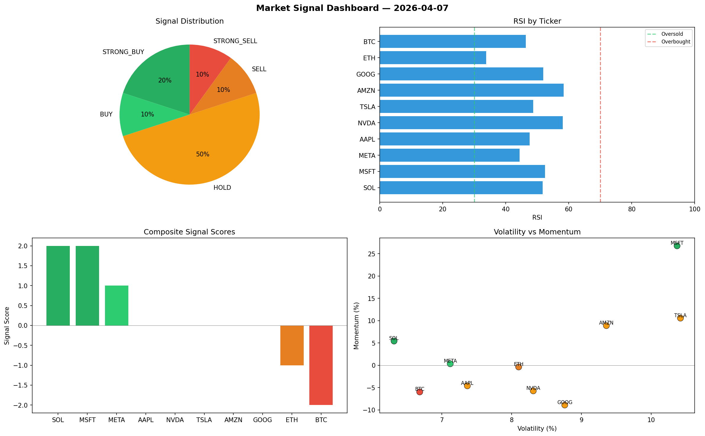

# Market Signal Report — 2026-04-07

**Run ID:** `8080c10017` | **Buy:** 3 | **Sell:** 2 | **Hold:** 5

## Signal Dashboard

| Ticker | Price | Signal | Score | RSI | Momentum | Confidence |
|--------|-------|--------|-------|-----|----------|------------|
| SOL | $1025.67 | **STRONG_BUY** | 2 | 51.68 | 0.0543 | 0.5 |
| MSFT | $2787.05 | **STRONG_BUY** | 2 | 52.49 | 0.2677 | 0.5 |
| META | $2995.28 | **BUY** | 1 | 44.36 | 0.0034 | 0.25 |
| AAPL | $4717.06 | **HOLD** | 0 | 47.62 | -0.046 | 0.0 |
| NVDA | $4198.9 | **HOLD** | 0 | 58.08 | -0.0573 | 0.0 |
| TSLA | $4035.83 | **HOLD** | 0 | 48.68 | 0.1057 | 0.0 |
| AMZN | $741.92 | **HOLD** | 0 | 58.4 | 0.0889 | 0.0 |
| GOOG | $2392.49 | **HOLD** | 0 | 51.86 | -0.089 | 0.0 |
| ETH | $4184.96 | **SELL** | -1 | 33.76 | -0.0037 | 0.25 |
| BTC | $2734.85 | **STRONG_SELL** | -2 | 46.37 | -0.0597 | 0.5 |

## Delta vs Yesterday

| Ticker | Today | Yesterday | Price Change | Signal Changed |
|--------|-------|-----------|-------------|----------------|
| SOL | STRONG_BUY | STRONG_BUY | 📉 -75.05% | — |
| MSFT | STRONG_BUY | SELL | 📈 94.41% | ⚠️ YES |
| META | BUY | HOLD | 📈 81.31% | ⚠️ YES |
| AAPL | HOLD | HOLD | 📈 23.54% | — |
| NVDA | HOLD | STRONG_BUY | 📈 171.0% | ⚠️ YES |
| TSLA | HOLD | HOLD | 📈 126.27% | — |
| AMZN | HOLD | SELL | 📈 159.63% | ⚠️ YES |
| GOOG | HOLD | STRONG_BUY | 📉 -2.37% | ⚠️ YES |
| ETH | SELL | STRONG_SELL | 📈 184.7% | ⚠️ YES |
| BTC | STRONG_SELL | HOLD | 📉 -45.76% | ⚠️ YES |