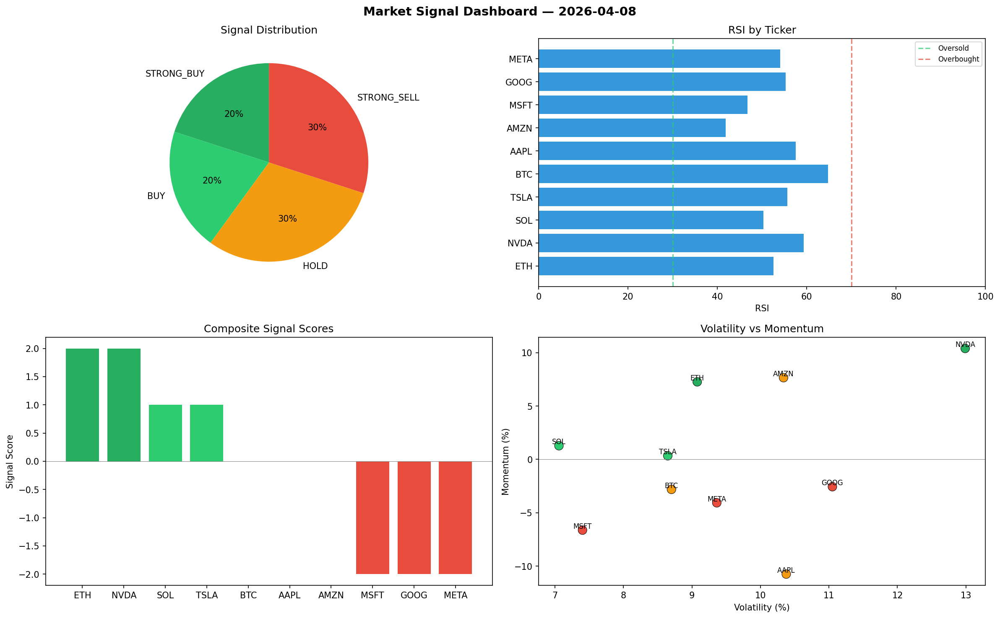

# Market Signal Report — 2026-04-08

**Run ID:** `55b9be018f` | **Buy:** 4 | **Sell:** 3 | **Hold:** 3

## Signal Dashboard

| Ticker | Price | Signal | Score | RSI | Momentum | Confidence |
|--------|-------|--------|-------|-----|----------|------------|
| ETH | $1119.2 | **STRONG_BUY** | 2 | 52.52 | 0.0727 | 0.5 |
| NVDA | $4668.64 | **STRONG_BUY** | 2 | 59.27 | 0.104 | 0.5 |
| SOL | $4502.32 | **BUY** | 1 | 50.3 | 0.0128 | 0.25 |
| TSLA | $3456.01 | **BUY** | 1 | 55.61 | 0.0034 | 0.25 |
| BTC | $5259.25 | **HOLD** | 0 | 64.73 | -0.0281 | 0.0 |
| AAPL | $965.8 | **HOLD** | 0 | 57.52 | -0.1075 | 0.0 |
| AMZN | $3344.79 | **HOLD** | 0 | 41.89 | 0.0766 | 0.0 |
| MSFT | $3079.0 | **STRONG_SELL** | -2 | 46.73 | -0.0663 | 0.5 |
| GOOG | $4144.35 | **STRONG_SELL** | -2 | 55.31 | -0.0256 | 0.5 |
| META | $2411.63 | **STRONG_SELL** | -2 | 54.08 | -0.0407 | 0.5 |

## Delta vs Yesterday

| Ticker | Today | Yesterday | Price Change | Signal Changed |
|--------|-------|-----------|-------------|----------------|
| ETH | STRONG_BUY | SELL | 📉 -73.26% | ⚠️ YES |
| NVDA | STRONG_BUY | HOLD | 📈 11.19% | ⚠️ YES |
| SOL | BUY | STRONG_BUY | 📈 338.96% | ⚠️ YES |
| TSLA | BUY | HOLD | 📉 -14.37% | ⚠️ YES |
| BTC | HOLD | STRONG_SELL | 📈 92.3% | ⚠️ YES |
| AAPL | HOLD | HOLD | 📉 -79.53% | — |
| AMZN | HOLD | HOLD | 📈 350.83% | — |
| MSFT | STRONG_SELL | STRONG_BUY | 📈 10.48% | ⚠️ YES |
| GOOG | STRONG_SELL | HOLD | 📈 73.22% | ⚠️ YES |
| META | STRONG_SELL | BUY | 📉 -19.49% | ⚠️ YES |