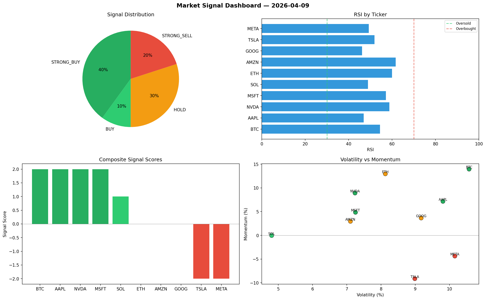

# Market Signal Report — 2026-04-09

**Run ID:** `c3da565e56` | **Buy:** 5 | **Sell:** 2 | **Hold:** 3

## Signal Dashboard

| Ticker | Price | Signal | Score | RSI | Momentum | Confidence |
|--------|-------|--------|-------|-----|----------|------------|
| BTC | $3265.07 | **STRONG_BUY** | 2 | 54.44 | 0.1395 | 0.5 |
| AAPL | $2082.17 | **STRONG_BUY** | 2 | 46.92 | 0.0716 | 0.5 |
| NVDA | $50.74 | **STRONG_BUY** | 2 | 58.74 | 0.0891 | 0.5 |
| MSFT | $864.61 | **STRONG_BUY** | 2 | 57.16 | 0.0485 | 0.5 |
| SOL | $2935.82 | **BUY** | 1 | 48.89 | -0.0004 | 0.25 |
| ETH | $4001.37 | **HOLD** | 0 | 59.95 | 0.1296 | 0.0 |
| AMZN | $2034.07 | **HOLD** | 0 | 61.65 | 0.0295 | 0.0 |
| GOOG | $2860.12 | **HOLD** | 0 | 46.21 | 0.0365 | 0.0 |
| TSLA | $1865.07 | **STRONG_SELL** | -2 | 51.91 | -0.0913 | 0.5 |
| META | $4609.79 | **STRONG_SELL** | -2 | 49.24 | -0.0437 | 0.5 |

## Delta vs Yesterday

| Ticker | Today | Yesterday | Price Change | Signal Changed |
|--------|-------|-----------|-------------|----------------|
| BTC | STRONG_BUY | HOLD | 📈 82.95% | ⚠️ YES |
| AAPL | STRONG_BUY | HOLD | 📉 -53.37% | ⚠️ YES |
| NVDA | STRONG_BUY | STRONG_SELL | 📉 -90.94% | ⚠️ YES |
| MSFT | STRONG_BUY | SELL | 📈 103.64% | ⚠️ YES |
| SOL | BUY | STRONG_SELL | 📈 230.75% | ⚠️ YES |
| ETH | HOLD | STRONG_SELL | 📈 322.42% | ⚠️ YES |
| AMZN | HOLD | HOLD | 📈 13.77% | — |
| GOOG | HOLD | BUY | 📉 -20.52% | ⚠️ YES |
| TSLA | STRONG_SELL | STRONG_SELL | 📉 -58.86% | — |
| META | STRONG_SELL | STRONG_SELL | 📈 45.23% | — |