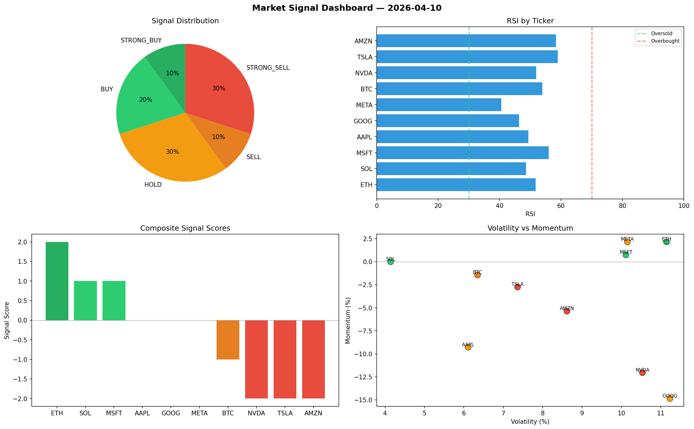

# Market Signal Report — 2026-04-10

**Run ID:** `4a8a01f0c8` | **Buy:** 3 | **Sell:** 4 | **Hold:** 3

## Signal Dashboard

| Ticker | Price | Signal | Score | RSI | Momentum | Confidence |
|--------|-------|--------|-------|-----|----------|------------|
| ETH | $2220.18 | **STRONG_BUY** | 2 | 51.75 | 0.0215 | 0.5 |
| SOL | $4572.23 | **BUY** | 1 | 48.63 | -0.0001 | 0.25 |
| MSFT | $3306.45 | **BUY** | 1 | 55.97 | 0.0074 | 0.25 |
| AAPL | $3549.74 | **HOLD** | 0 | 49.35 | -0.0929 | 0.0 |
| GOOG | $4278.39 | **HOLD** | 0 | 46.36 | -0.1485 | 0.0 |
| META | $2970.72 | **HOLD** | 0 | 40.58 | 0.0214 | 0.0 |
| BTC | $1283.76 | **SELL** | -1 | 53.91 | -0.0144 | 0.25 |
| NVDA | $4460.33 | **STRONG_SELL** | -2 | 51.92 | -0.1205 | 0.5 |
| TSLA | $356.39 | **STRONG_SELL** | -2 | 58.9 | -0.0275 | 0.5 |
| AMZN | $761.31 | **STRONG_SELL** | -2 | 58.36 | -0.0537 | 0.5 |

## Delta vs Yesterday

| Ticker | Today | Yesterday | Price Change | Signal Changed |
|--------|-------|-----------|-------------|----------------|
| ETH | STRONG_BUY | BUY | 📉 -36.46% | ⚠️ YES |
| SOL | BUY | HOLD | 📈 84.78% | ⚠️ YES |
| MSFT | BUY | STRONG_SELL | 📉 -26.18% | ⚠️ YES |
| AAPL | HOLD | HOLD | 📈 35.17% | — |
| GOOG | HOLD | STRONG_BUY | 📈 102.69% | ⚠️ YES |
| META | HOLD | SELL | 📈 49.9% | ⚠️ YES |
| BTC | SELL | STRONG_BUY | 📉 -75.06% | ⚠️ YES |
| NVDA | STRONG_SELL | STRONG_BUY | 📈 270.27% | ⚠️ YES |
| TSLA | STRONG_SELL | STRONG_SELL | 📉 -74.27% | — |
| AMZN | STRONG_SELL | HOLD | 📉 -80.92% | ⚠️ YES |