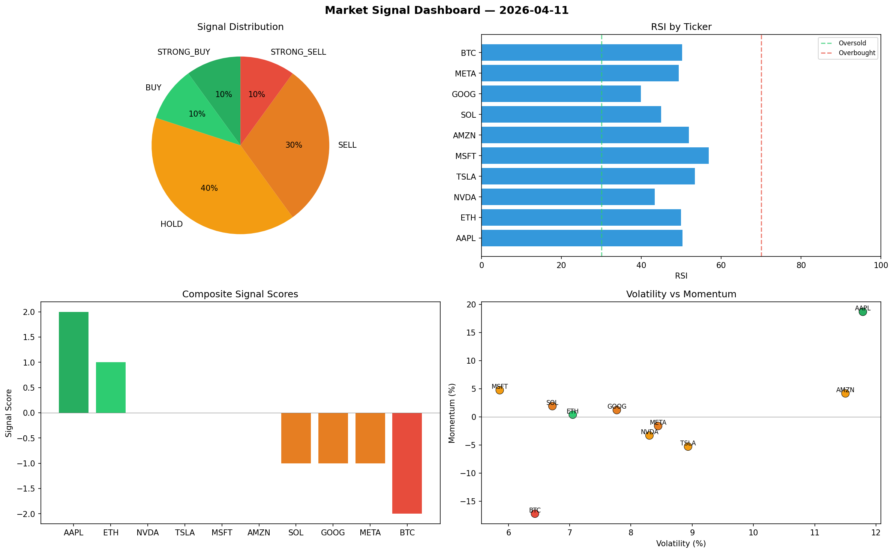

# Market Signal Report — 2026-04-11

**Run ID:** `7ec92b0db5` | **Buy:** 2 | **Sell:** 4 | **Hold:** 4

## Signal Dashboard

| Ticker | Price | Signal | Score | RSI | Momentum | Confidence |
|--------|-------|--------|-------|-----|----------|------------|
| AAPL | $2672.69 | **STRONG_BUY** | 2 | 50.28 | 0.1867 | 0.5 |
| ETH | $4035.4 | **BUY** | 1 | 49.89 | 0.0038 | 0.25 |
| NVDA | $2480.15 | **HOLD** | 0 | 43.33 | -0.0332 | 0.0 |
| TSLA | $4701.41 | **HOLD** | 0 | 53.41 | -0.0529 | 0.0 |
| MSFT | $2219.75 | **HOLD** | 0 | 56.85 | 0.0473 | 0.0 |
| AMZN | $1574.8 | **HOLD** | 0 | 51.9 | 0.0416 | 0.0 |
| SOL | $1391.16 | **SELL** | -1 | 44.94 | 0.019 | 0.25 |
| GOOG | $669.87 | **SELL** | -1 | 39.86 | 0.012 | 0.25 |
| META | $2529.37 | **SELL** | -1 | 49.38 | -0.0163 | 0.25 |
| BTC | $23.61 | **STRONG_SELL** | -2 | 50.21 | -0.1722 | 0.5 |

## Delta vs Yesterday

| Ticker | Today | Yesterday | Price Change | Signal Changed |
|--------|-------|-----------|-------------|----------------|
| AAPL | STRONG_BUY | HOLD | 📉 -24.71% | ⚠️ YES |
| ETH | BUY | STRONG_BUY | 📈 81.76% | ⚠️ YES |
| NVDA | HOLD | STRONG_SELL | 📉 -44.4% | ⚠️ YES |
| TSLA | HOLD | STRONG_SELL | 📈 1219.18% | ⚠️ YES |
| MSFT | HOLD | BUY | 📉 -32.87% | ⚠️ YES |
| AMZN | HOLD | STRONG_SELL | 📈 106.85% | ⚠️ YES |
| SOL | SELL | BUY | 📉 -69.57% | ⚠️ YES |
| GOOG | SELL | HOLD | 📉 -84.34% | ⚠️ YES |
| META | SELL | HOLD | 📉 -14.86% | ⚠️ YES |
| BTC | STRONG_SELL | SELL | 📉 -98.16% | ⚠️ YES |