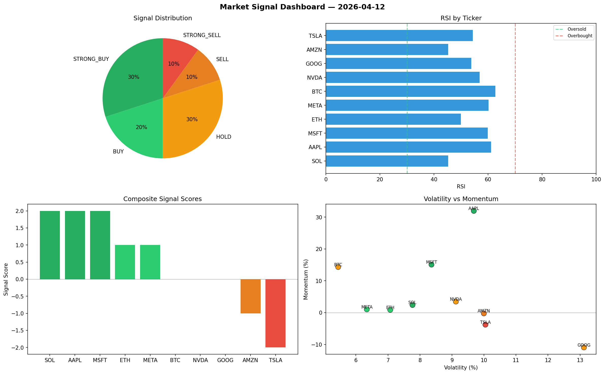

# Market Signal Report — 2026-04-12

**Run ID:** `68137238c7` | **Buy:** 5 | **Sell:** 2 | **Hold:** 3

## Signal Dashboard

| Ticker | Price | Signal | Score | RSI | Momentum | Confidence |
|--------|-------|--------|-------|-----|----------|------------|
| SOL | $612.51 | **STRONG_BUY** | 2 | 45.25 | 0.0239 | 0.5 |
| AAPL | $967.62 | **STRONG_BUY** | 2 | 61.11 | 0.3194 | 0.5 |
| MSFT | $1498.56 | **STRONG_BUY** | 2 | 59.88 | 0.1507 | 0.5 |
| ETH | $1690.65 | **BUY** | 1 | 49.9 | 0.0087 | 0.25 |
| META | $1592.25 | **BUY** | 1 | 60.17 | 0.0103 | 0.25 |
| BTC | $3654.55 | **HOLD** | 0 | 62.66 | 0.1432 | 0.0 |
| NVDA | $3376.02 | **HOLD** | 0 | 56.84 | 0.0347 | 0.0 |
| GOOG | $2533.71 | **HOLD** | 0 | 53.77 | -0.1092 | 0.0 |
| AMZN | $1515.23 | **SELL** | -1 | 45.21 | -0.0024 | 0.25 |
| TSLA | $2854.74 | **STRONG_SELL** | -2 | 54.32 | -0.0378 | 0.5 |

## Delta vs Yesterday

| Ticker | Today | Yesterday | Price Change | Signal Changed |
|--------|-------|-----------|-------------|----------------|
| SOL | STRONG_BUY | SELL | 📉 -55.97% | ⚠️ YES |
| AAPL | STRONG_BUY | STRONG_BUY | 📉 -63.8% | — |
| MSFT | STRONG_BUY | HOLD | 📉 -32.49% | ⚠️ YES |
| ETH | BUY | BUY | 📉 -58.1% | — |
| META | BUY | SELL | 📉 -37.05% | ⚠️ YES |
| BTC | HOLD | STRONG_SELL | 📈 15378.82% | ⚠️ YES |
| NVDA | HOLD | HOLD | 📈 36.12% | — |
| GOOG | HOLD | SELL | 📈 278.24% | ⚠️ YES |
| AMZN | SELL | HOLD | 📉 -3.78% | ⚠️ YES |
| TSLA | STRONG_SELL | HOLD | 📉 -39.28% | ⚠️ YES |