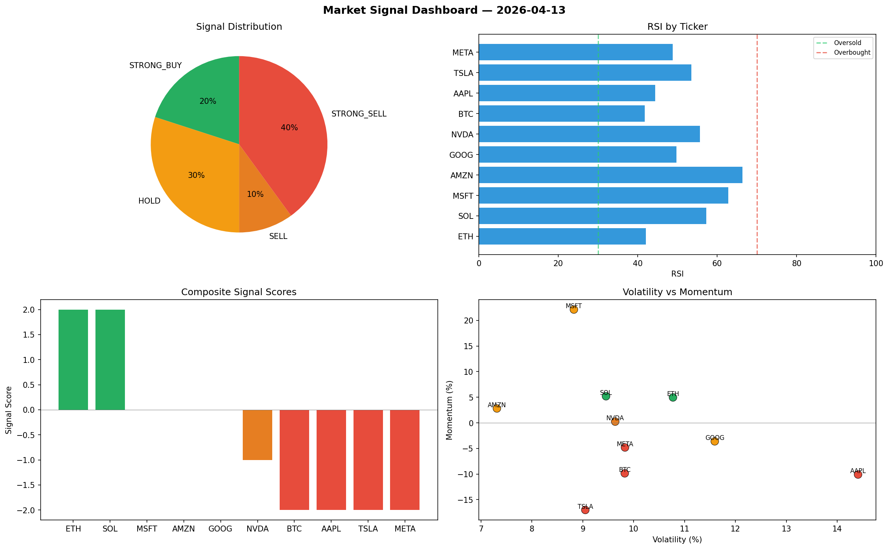

# Market Signal Report — 2026-04-13

**Run ID:** `14427852fd` | **Buy:** 2 | **Sell:** 5 | **Hold:** 3

## Signal Dashboard

| Ticker | Price | Signal | Score | RSI | Momentum | Confidence |
|--------|-------|--------|-------|-----|----------|------------|
| ETH | $1131.81 | **STRONG_BUY** | 2 | 42.01 | 0.0496 | 0.5 |
| SOL | $2083.93 | **STRONG_BUY** | 2 | 57.26 | 0.0519 | 0.5 |
| MSFT | $3433.02 | **HOLD** | 0 | 62.75 | 0.2212 | 0.0 |
| AMZN | $3756.69 | **HOLD** | 0 | 66.4 | 0.0281 | 0.0 |
| GOOG | $2322.78 | **HOLD** | 0 | 49.76 | -0.0361 | 0.0 |
| NVDA | $611.93 | **SELL** | -1 | 55.65 | 0.0024 | 0.25 |
| BTC | $438.56 | **STRONG_SELL** | -2 | 41.75 | -0.0986 | 0.5 |
| AAPL | $3985.91 | **STRONG_SELL** | -2 | 44.38 | -0.1009 | 0.5 |
| TSLA | $617.71 | **STRONG_SELL** | -2 | 53.5 | -0.1701 | 0.5 |
| META | $865.51 | **STRONG_SELL** | -2 | 48.83 | -0.0481 | 0.5 |

## Delta vs Yesterday

| Ticker | Today | Yesterday | Price Change | Signal Changed |
|--------|-------|-----------|-------------|----------------|
| ETH | STRONG_BUY | STRONG_SELL | 📉 -67.6% | ⚠️ YES |
| SOL | STRONG_BUY | HOLD | 📈 292.34% | ⚠️ YES |
| MSFT | HOLD | STRONG_SELL | 📈 250.41% | ⚠️ YES |
| AMZN | HOLD | STRONG_BUY | 📈 27.04% | ⚠️ YES |
| GOOG | HOLD | BUY | 📉 -40.26% | ⚠️ YES |
| NVDA | SELL | BUY | 📉 -41.41% | ⚠️ YES |
| BTC | STRONG_SELL | STRONG_SELL | 📉 -77.99% | — |
| AAPL | STRONG_SELL | HOLD | 📉 -2.5% | ⚠️ YES |
| TSLA | STRONG_SELL | BUY | 📉 -73.04% | ⚠️ YES |
| META | STRONG_SELL | STRONG_BUY | 📉 -58.91% | ⚠️ YES |