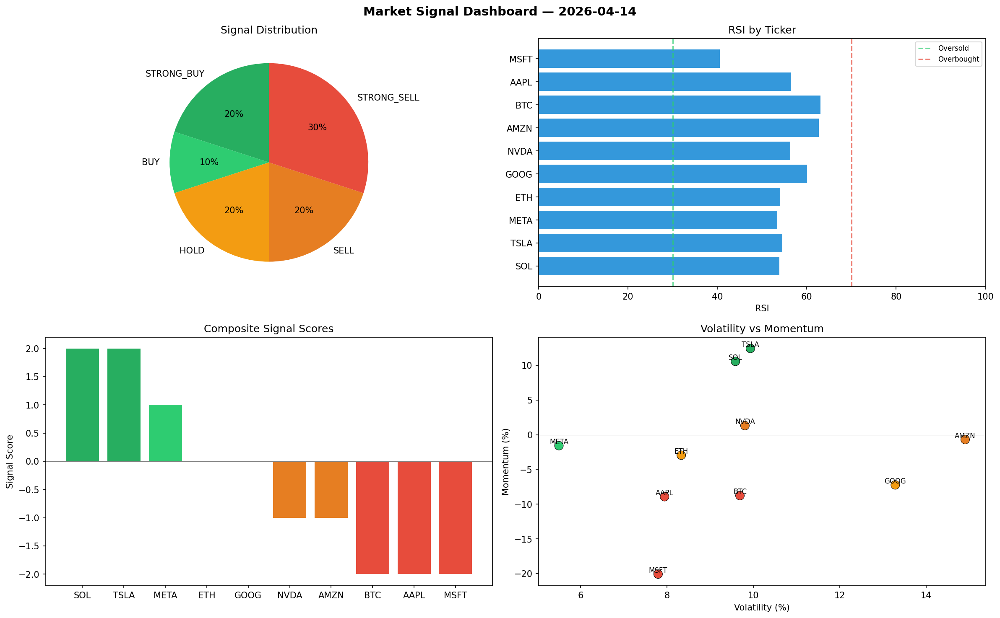

# Market Signal Report — 2026-04-14

**Run ID:** `b0e3338cef` | **Buy:** 3 | **Sell:** 5 | **Hold:** 2

## Signal Dashboard

| Ticker | Price | Signal | Score | RSI | Momentum | Confidence |
|--------|-------|--------|-------|-----|----------|------------|
| SOL | $4181.54 | **STRONG_BUY** | 2 | 53.83 | 0.1056 | 0.5 |
| TSLA | $1337.82 | **STRONG_BUY** | 2 | 54.53 | 0.1242 | 0.5 |
| META | $4056.34 | **BUY** | 1 | 53.38 | -0.0158 | 0.25 |
| ETH | $3274.8 | **HOLD** | 0 | 54.09 | -0.0295 | 0.0 |
| GOOG | $2450.97 | **HOLD** | 0 | 60.09 | -0.0723 | 0.0 |
| NVDA | $547.08 | **SELL** | -1 | 56.27 | 0.0131 | 0.25 |
| AMZN | $4447.52 | **SELL** | -1 | 62.74 | -0.007 | 0.25 |
| BTC | $2976.17 | **STRONG_SELL** | -2 | 63.06 | -0.0877 | 0.5 |
| AAPL | $453.6 | **STRONG_SELL** | -2 | 56.54 | -0.0893 | 0.5 |
| MSFT | $80.95 | **STRONG_SELL** | -2 | 40.55 | -0.2007 | 0.5 |

## Delta vs Yesterday

| Ticker | Today | Yesterday | Price Change | Signal Changed |
|--------|-------|-----------|-------------|----------------|
| SOL | STRONG_BUY | STRONG_BUY | 📈 5015.03% | — |
| TSLA | STRONG_BUY | STRONG_BUY | 📈 3.63% | — |
| META | BUY | STRONG_SELL | 📈 31.89% | ⚠️ YES |
| ETH | HOLD | HOLD | 📈 43.35% | — |
| GOOG | HOLD | STRONG_SELL | 📈 23.77% | ⚠️ YES |
| NVDA | SELL | HOLD | 📉 -54.66% | ⚠️ YES |
| AMZN | SELL | BUY | 📈 21.45% | ⚠️ YES |
| BTC | STRONG_SELL | HOLD | 📈 127.45% | ⚠️ YES |
| AAPL | STRONG_SELL | HOLD | 📉 -65.71% | ⚠️ YES |
| MSFT | STRONG_SELL | SELL | 📉 -98.26% | ⚠️ YES |