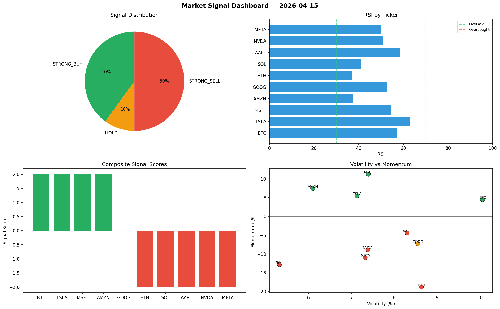

# Market Signal Report — 2026-04-15

**Run ID:** `1c7da3e2ee` | **Buy:** 4 | **Sell:** 5 | **Hold:** 1

## Signal Dashboard

| Ticker | Price | Signal | Score | RSI | Momentum | Confidence |
|--------|-------|--------|-------|-----|----------|------------|
| BTC | $902.08 | **STRONG_BUY** | 2 | 57.36 | 0.0448 | 0.5 |
| TSLA | $2801.79 | **STRONG_BUY** | 2 | 62.84 | 0.0549 | 0.5 |
| MSFT | $5051.44 | **STRONG_BUY** | 2 | 54.34 | 0.1122 | 0.5 |
| AMZN | $2922.67 | **STRONG_BUY** | 2 | 37.31 | 0.0742 | 0.5 |
| GOOG | $429.91 | **HOLD** | 0 | 52.48 | -0.0726 | 0.0 |
| ETH | $3792.28 | **STRONG_SELL** | -2 | 37.14 | -0.1881 | 0.5 |
| SOL | $3147.9 | **STRONG_SELL** | -2 | 41.0 | -0.1284 | 0.5 |
| AAPL | $3929.57 | **STRONG_SELL** | -2 | 58.61 | -0.0444 | 0.5 |
| NVDA | $3531.96 | **STRONG_SELL** | -2 | 50.92 | -0.089 | 0.5 |
| META | $3312.36 | **STRONG_SELL** | -2 | 49.83 | -0.1098 | 0.5 |

## Delta vs Yesterday

| Ticker | Today | Yesterday | Price Change | Signal Changed |
|--------|-------|-----------|-------------|----------------|
| BTC | STRONG_BUY | HOLD | 📉 -62.4% | ⚠️ YES |
| TSLA | STRONG_BUY | STRONG_SELL | 📈 61.48% | ⚠️ YES |
| MSFT | STRONG_BUY | STRONG_SELL | 📈 206.19% | ⚠️ YES |
| AMZN | STRONG_BUY | STRONG_BUY | 📈 127.43% | — |
| GOOG | HOLD | SELL | 📈 4.07% | ⚠️ YES |
| ETH | STRONG_SELL | STRONG_BUY | 📈 377.06% | ⚠️ YES |
| SOL | STRONG_SELL | SELL | 📈 134.59% | ⚠️ YES |
| AAPL | STRONG_SELL | STRONG_SELL | 📉 -0.44% | — |
| NVDA | STRONG_SELL | HOLD | 📈 47.95% | ⚠️ YES |
| META | STRONG_SELL | STRONG_BUY | 📉 -19.68% | ⚠️ YES |