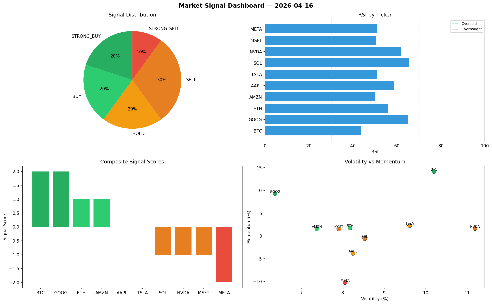

# Market Signal Report — 2026-04-16

**Run ID:** `27e371f5a0` | **Buy:** 4 | **Sell:** 4 | **Hold:** 2

## Signal Dashboard

| Ticker | Price | Signal | Score | RSI | Momentum | Confidence |
|--------|-------|--------|-------|-----|----------|------------|
| BTC | $2971.99 | **STRONG_BUY** | 2 | 43.67 | 0.1416 | 0.5 |
| GOOG | $3865.58 | **STRONG_BUY** | 2 | 65.15 | 0.0929 | 0.5 |
| ETH | $2660.65 | **BUY** | 1 | 55.86 | 0.0177 | 0.25 |
| AMZN | $1000.37 | **BUY** | 1 | 50.15 | 0.0157 | 0.25 |
| AAPL | $1396.73 | **HOLD** | 0 | 58.83 | -0.0382 | 0.0 |
| TSLA | $745.31 | **HOLD** | 0 | 50.76 | 0.0229 | 0.0 |
| SOL | $2497.23 | **SELL** | -1 | 65.4 | -0.0059 | 0.25 |
| NVDA | $4657.08 | **SELL** | -1 | 61.96 | 0.0163 | 0.25 |
| MSFT | $4173.72 | **SELL** | -1 | 50.52 | 0.0152 | 0.25 |
| META | $3152.62 | **STRONG_SELL** | -2 | 50.73 | -0.1021 | 0.5 |

## Delta vs Yesterday

| Ticker | Today | Yesterday | Price Change | Signal Changed |
|--------|-------|-----------|-------------|----------------|
| BTC | STRONG_BUY | STRONG_BUY | 📉 -20.19% | — |
| GOOG | STRONG_BUY | STRONG_SELL | 📈 139.38% | ⚠️ YES |
| ETH | BUY | STRONG_SELL | 📈 6.48% | ⚠️ YES |
| AMZN | BUY | STRONG_BUY | 📉 -78.28% | ⚠️ YES |
| AAPL | HOLD | STRONG_SELL | 📈 225.51% | ⚠️ YES |
| TSLA | HOLD | SELL | 📈 53.56% | ⚠️ YES |
| SOL | SELL | SELL | 📉 -25.38% | — |
| NVDA | SELL | STRONG_BUY | 📈 3306.04% | ⚠️ YES |
| MSFT | SELL | STRONG_SELL | 📈 15.69% | ⚠️ YES |
| META | STRONG_SELL | STRONG_SELL | 📉 -22.61% | — |