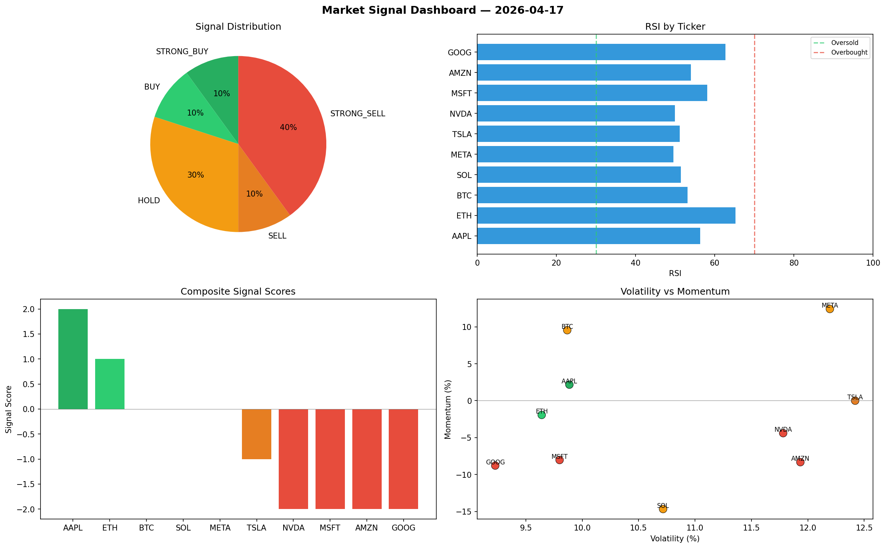

# Market Signal Report — 2026-04-17

**Run ID:** `4b8f39da7f` | **Buy:** 2 | **Sell:** 5 | **Hold:** 3

## Signal Dashboard

| Ticker | Price | Signal | Score | RSI | Momentum | Confidence |
|--------|-------|--------|-------|-----|----------|------------|
| AAPL | $826.27 | **STRONG_BUY** | 2 | 56.29 | 0.0217 | 0.5 |
| ETH | $3763.6 | **BUY** | 1 | 65.2 | -0.0193 | 0.25 |
| BTC | $1525.76 | **HOLD** | 0 | 53.16 | 0.0955 | 0.0 |
| SOL | $895.11 | **HOLD** | 0 | 51.42 | -0.1468 | 0.0 |
| META | $4576.48 | **HOLD** | 0 | 49.52 | 0.1242 | 0.0 |
| TSLA | $3783.25 | **SELL** | -1 | 51.19 | -0.0 | 0.25 |
| NVDA | $2291.2 | **STRONG_SELL** | -2 | 49.92 | -0.044 | 0.5 |
| MSFT | $779.53 | **STRONG_SELL** | -2 | 58.05 | -0.0804 | 0.5 |
| AMZN | $1031.35 | **STRONG_SELL** | -2 | 53.92 | -0.0833 | 0.5 |
| GOOG | $3770.24 | **STRONG_SELL** | -2 | 62.73 | -0.0879 | 0.5 |

## Delta vs Yesterday

| Ticker | Today | Yesterday | Price Change | Signal Changed |
|--------|-------|-----------|-------------|----------------|
| AAPL | STRONG_BUY | STRONG_BUY | 📉 -78.96% | — |
| ETH | BUY | HOLD | 📈 55.87% | ⚠️ YES |
| BTC | HOLD | STRONG_SELL | 📉 -62.09% | ⚠️ YES |
| SOL | HOLD | STRONG_SELL | 📈 228.35% | ⚠️ YES |
| META | HOLD | SELL | 📈 617.14% | ⚠️ YES |
| TSLA | SELL | STRONG_BUY | 📈 6.96% | ⚠️ YES |
| NVDA | STRONG_SELL | HOLD | 📉 -33.73% | ⚠️ YES |
| MSFT | STRONG_SELL | SELL | 📈 75.32% | ⚠️ YES |
| AMZN | STRONG_SELL | STRONG_BUY | 📉 -49.17% | ⚠️ YES |
| GOOG | STRONG_SELL | HOLD | 📈 72.31% | ⚠️ YES |