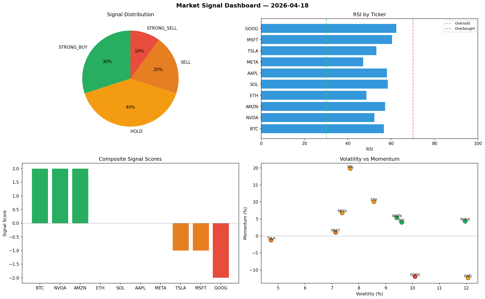

# Market Signal Report — 2026-04-18

**Run ID:** `e02635e7f3` | **Buy:** 3 | **Sell:** 3 | **Hold:** 4

## Signal Dashboard

| Ticker | Price | Signal | Score | RSI | Momentum | Confidence |
|--------|-------|--------|-------|-----|----------|------------|
| BTC | $55.23 | **STRONG_BUY** | 2 | 56.64 | 0.0399 | 0.5 |
| NVDA | $4526.26 | **STRONG_BUY** | 2 | 52.19 | 0.043 | 0.5 |
| AMZN | $3983.45 | **STRONG_BUY** | 2 | 57.12 | 0.0534 | 0.5 |
| ETH | $4167.43 | **HOLD** | 0 | 48.51 | 0.1006 | 0.0 |
| SOL | $3815.13 | **HOLD** | 0 | 58.37 | 0.1979 | 0.0 |
| AAPL | $744.33 | **HOLD** | 0 | 57.99 | -0.1231 | 0.0 |
| META | $2518.99 | **HOLD** | 0 | 47.05 | 0.0674 | 0.0 |
| TSLA | $394.79 | **SELL** | -1 | 53.16 | -0.0125 | 0.25 |
| MSFT | $4353.17 | **SELL** | -1 | 60.32 | 0.0102 | 0.25 |
| GOOG | $2401.78 | **STRONG_SELL** | -2 | 62.31 | -0.1197 | 0.5 |

## Delta vs Yesterday

| Ticker | Today | Yesterday | Price Change | Signal Changed |
|--------|-------|-----------|-------------|----------------|
| BTC | STRONG_BUY | STRONG_BUY | 📉 -91.46% | — |
| NVDA | STRONG_BUY | STRONG_SELL | 📈 812.09% | ⚠️ YES |
| AMZN | STRONG_BUY | STRONG_SELL | 📈 33.25% | ⚠️ YES |
| ETH | HOLD | HOLD | 📈 299.33% | — |
| SOL | HOLD | STRONG_BUY | 📈 112.12% | ⚠️ YES |
| AAPL | HOLD | STRONG_BUY | 📉 -80.54% | ⚠️ YES |
| META | HOLD | STRONG_BUY | 📉 -41.61% | ⚠️ YES |
| TSLA | SELL | SELL | 📉 -84.21% | — |
| MSFT | SELL | HOLD | 📈 93.54% | ⚠️ YES |
| GOOG | STRONG_SELL | BUY | 📉 -33.64% | ⚠️ YES |