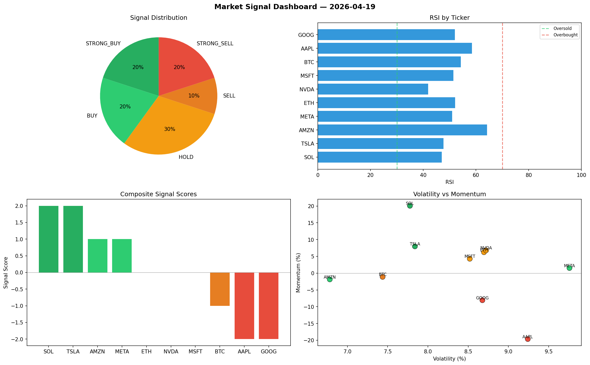

# Market Signal Report — 2026-04-19

**Run ID:** `2245e6da44` | **Buy:** 4 | **Sell:** 3 | **Hold:** 3

## Signal Dashboard

| Ticker | Price | Signal | Score | RSI | Momentum | Confidence |
|--------|-------|--------|-------|-----|----------|------------|
| SOL | $3656.99 | **STRONG_BUY** | 2 | 47.06 | 0.2007 | 0.5 |
| TSLA | $3993.6 | **STRONG_BUY** | 2 | 47.65 | 0.0797 | 0.5 |
| AMZN | $567.05 | **BUY** | 1 | 64.18 | -0.0187 | 0.25 |
| META | $5056.74 | **BUY** | 1 | 50.95 | 0.0152 | 0.25 |
| ETH | $3762.45 | **HOLD** | 0 | 52.05 | 0.0623 | 0.0 |
| NVDA | $3382.82 | **HOLD** | 0 | 41.87 | 0.0679 | 0.0 |
| MSFT | $4539.75 | **HOLD** | 0 | 51.44 | 0.0428 | 0.0 |
| BTC | $1614.44 | **SELL** | -1 | 54.27 | -0.0112 | 0.25 |
| AAPL | $4355.59 | **STRONG_SELL** | -2 | 58.45 | -0.1965 | 0.5 |
| GOOG | $4187.38 | **STRONG_SELL** | -2 | 52.0 | -0.0808 | 0.5 |

## Delta vs Yesterday

| Ticker | Today | Yesterday | Price Change | Signal Changed |
|--------|-------|-----------|-------------|----------------|
| SOL | STRONG_BUY | HOLD | 📉 -4.15% | ⚠️ YES |
| TSLA | STRONG_BUY | SELL | 📈 911.58% | ⚠️ YES |
| AMZN | BUY | STRONG_BUY | 📉 -85.76% | ⚠️ YES |
| META | BUY | HOLD | 📈 100.74% | ⚠️ YES |
| ETH | HOLD | HOLD | 📉 -9.72% | — |
| NVDA | HOLD | STRONG_BUY | 📉 -25.26% | ⚠️ YES |
| MSFT | HOLD | SELL | 📈 4.29% | ⚠️ YES |
| BTC | SELL | STRONG_BUY | 📈 2823.12% | ⚠️ YES |
| AAPL | STRONG_SELL | HOLD | 📈 485.17% | ⚠️ YES |
| GOOG | STRONG_SELL | STRONG_SELL | 📈 74.34% | — |