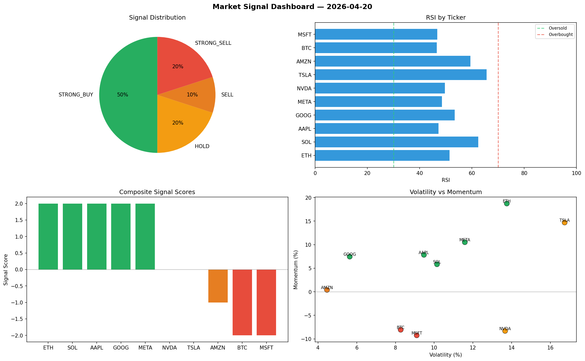

# Market Signal Report — 2026-04-20

**Run ID:** `d21d221939` | **Buy:** 5 | **Sell:** 3 | **Hold:** 2

## Signal Dashboard

| Ticker | Price | Signal | Score | RSI | Momentum | Confidence |
|--------|-------|--------|-------|-----|----------|------------|
| ETH | $2917.82 | **STRONG_BUY** | 2 | 51.43 | 0.1872 | 0.5 |
| SOL | $2635.99 | **STRONG_BUY** | 2 | 62.45 | 0.0583 | 0.5 |
| AAPL | $473.95 | **STRONG_BUY** | 2 | 47.24 | 0.0783 | 0.5 |
| GOOG | $453.18 | **STRONG_BUY** | 2 | 53.4 | 0.0745 | 0.5 |
| META | $2624.94 | **STRONG_BUY** | 2 | 48.49 | 0.1051 | 0.5 |
| NVDA | $3165.41 | **HOLD** | 0 | 49.67 | -0.0831 | 0.0 |
| TSLA | $3979.99 | **HOLD** | 0 | 65.58 | 0.1469 | 0.0 |
| AMZN | $1068.62 | **SELL** | -1 | 59.45 | 0.0039 | 0.25 |
| BTC | $269.24 | **STRONG_SELL** | -2 | 46.54 | -0.0807 | 0.5 |
| MSFT | $3295.48 | **STRONG_SELL** | -2 | 46.75 | -0.0925 | 0.5 |

## Delta vs Yesterday

| Ticker | Today | Yesterday | Price Change | Signal Changed |
|--------|-------|-----------|-------------|----------------|
| ETH | STRONG_BUY | STRONG_SELL | 📈 320.07% | ⚠️ YES |
| SOL | STRONG_BUY | STRONG_BUY | 📉 -40.31% | — |
| AAPL | STRONG_BUY | STRONG_SELL | 📉 -51.24% | ⚠️ YES |
| GOOG | STRONG_BUY | BUY | 📉 -79.86% | ⚠️ YES |
| META | STRONG_BUY | STRONG_SELL | 📈 4.75% | ⚠️ YES |
| NVDA | HOLD | HOLD | 📈 34.73% | — |
| TSLA | HOLD | HOLD | 📈 22.32% | — |
| AMZN | SELL | HOLD | 📉 -78.3% | ⚠️ YES |
| BTC | STRONG_SELL | BUY | 📉 -91.26% | ⚠️ YES |
| MSFT | STRONG_SELL | HOLD | 📉 -18.43% | ⚠️ YES |