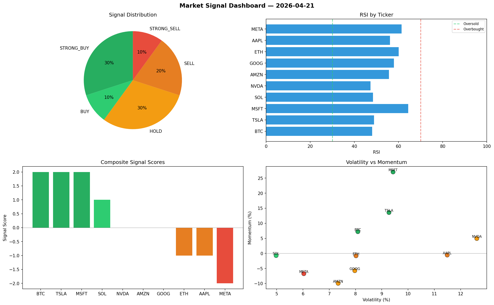

# Market Signal Report — 2026-04-21

**Run ID:** `e9694a7356` | **Buy:** 4 | **Sell:** 3 | **Hold:** 3

## Signal Dashboard

| Ticker | Price | Signal | Score | RSI | Momentum | Confidence |
|--------|-------|--------|-------|-----|----------|------------|
| BTC | $582.14 | **STRONG_BUY** | 2 | 48.09 | 0.0721 | 0.5 |
| TSLA | $322.9 | **STRONG_BUY** | 2 | 48.9 | 0.1357 | 0.5 |
| MSFT | $127.51 | **STRONG_BUY** | 2 | 64.38 | 0.2704 | 0.5 |
| SOL | $1846.69 | **BUY** | 1 | 48.46 | -0.0073 | 0.25 |
| NVDA | $1133.42 | **HOLD** | 0 | 47.33 | 0.0494 | 0.0 |
| AMZN | $3707.35 | **HOLD** | 0 | 55.61 | -0.0995 | 0.0 |
| GOOG | $4057.0 | **HOLD** | 0 | 57.92 | -0.0575 | 0.0 |
| ETH | $1371.89 | **SELL** | -1 | 60.06 | -0.0081 | 0.25 |
| AAPL | $2167.81 | **SELL** | -1 | 56.11 | -0.0056 | 0.25 |
| META | $2361.85 | **STRONG_SELL** | -2 | 61.35 | -0.0675 | 0.5 |

## Delta vs Yesterday

| Ticker | Today | Yesterday | Price Change | Signal Changed |
|--------|-------|-----------|-------------|----------------|
| BTC | STRONG_BUY | STRONG_SELL | 📈 116.22% | ⚠️ YES |
| TSLA | STRONG_BUY | HOLD | 📉 -91.89% | ⚠️ YES |
| MSFT | STRONG_BUY | STRONG_SELL | 📉 -96.13% | ⚠️ YES |
| SOL | BUY | STRONG_BUY | 📉 -29.94% | ⚠️ YES |
| NVDA | HOLD | HOLD | 📉 -64.19% | — |
| AMZN | HOLD | SELL | 📈 246.93% | ⚠️ YES |
| GOOG | HOLD | STRONG_BUY | 📈 795.23% | ⚠️ YES |
| ETH | SELL | STRONG_BUY | 📉 -52.98% | ⚠️ YES |
| AAPL | SELL | STRONG_BUY | 📈 357.39% | ⚠️ YES |
| META | STRONG_SELL | STRONG_BUY | 📉 -10.02% | ⚠️ YES |