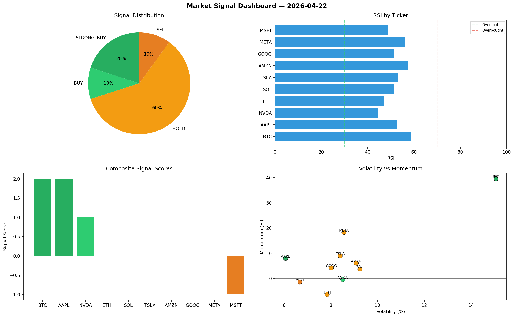

# Market Signal Report — 2026-04-22

**Run ID:** `65ed87333d` | **Buy:** 3 | **Sell:** 1 | **Hold:** 6

## Signal Dashboard

| Ticker | Price | Signal | Score | RSI | Momentum | Confidence |
|--------|-------|--------|-------|-----|----------|------------|
| BTC | $4773.14 | **STRONG_BUY** | 2 | 58.7 | 0.3955 | 0.5 |
| AAPL | $4514.13 | **STRONG_BUY** | 2 | 52.7 | 0.0792 | 0.5 |
| NVDA | $913.65 | **BUY** | 1 | 44.46 | -0.0043 | 0.25 |
| ETH | $677.09 | **HOLD** | 0 | 47.11 | -0.0638 | 0.0 |
| SOL | $4891.34 | **HOLD** | 0 | 51.27 | 0.037 | 0.0 |
| TSLA | $2733.53 | **HOLD** | 0 | 53.08 | 0.0891 | 0.0 |
| AMZN | $3147.1 | **HOLD** | 0 | 57.37 | 0.0603 | 0.0 |
| GOOG | $614.97 | **HOLD** | 0 | 51.57 | 0.042 | 0.0 |
| META | $193.38 | **HOLD** | 0 | 56.34 | 0.1823 | 0.0 |
| MSFT | $1462.18 | **SELL** | -1 | 48.75 | -0.0145 | 0.25 |

## Delta vs Yesterday

| Ticker | Today | Yesterday | Price Change | Signal Changed |
|--------|-------|-----------|-------------|----------------|
| BTC | STRONG_BUY | STRONG_SELL | 📈 50.61% | ⚠️ YES |
| AAPL | STRONG_BUY | HOLD | 📈 70.54% | ⚠️ YES |
| NVDA | BUY | STRONG_BUY | 📉 -81.48% | ⚠️ YES |
| ETH | HOLD | BUY | 📉 -72.22% | ⚠️ YES |
| SOL | HOLD | BUY | 📈 3031.66% | ⚠️ YES |
| TSLA | HOLD | HOLD | 📉 -19.34% | — |
| AMZN | HOLD | STRONG_SELL | 📈 50.97% | ⚠️ YES |
| GOOG | HOLD | HOLD | 📈 28.14% | — |
| META | HOLD | STRONG_SELL | 📉 -78.88% | ⚠️ YES |
| MSFT | SELL | STRONG_SELL | 📉 -17.04% | ⚠️ YES |