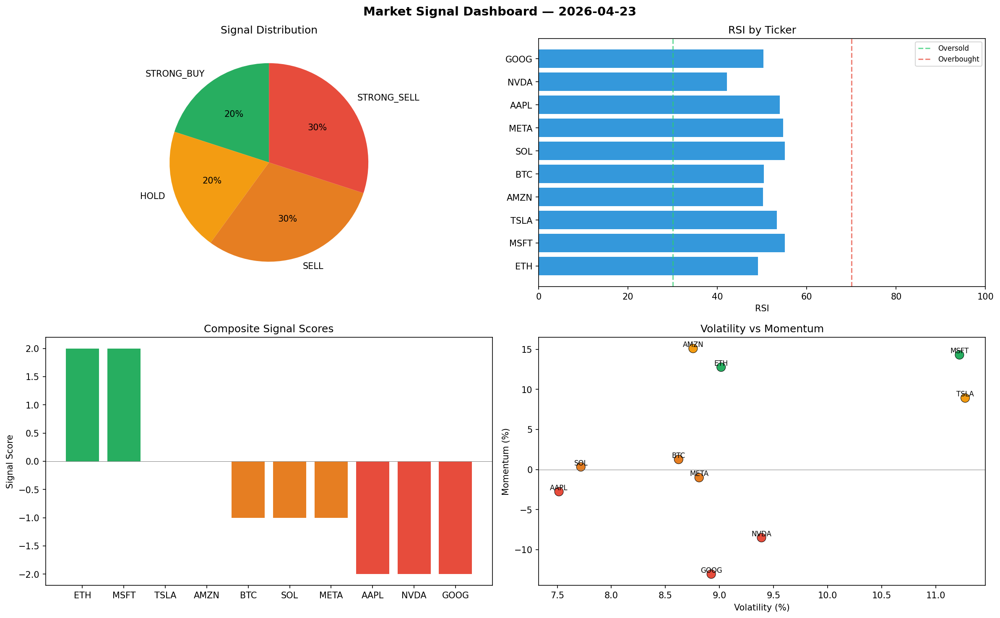

# Market Signal Report — 2026-04-23

**Run ID:** `3563bc4ac1` | **Buy:** 2 | **Sell:** 6 | **Hold:** 2

## Signal Dashboard

| Ticker | Price | Signal | Score | RSI | Momentum | Confidence |
|--------|-------|--------|-------|-----|----------|------------|
| ETH | $4232.15 | **STRONG_BUY** | 2 | 49.1 | 0.1277 | 0.5 |
| MSFT | $2829.2 | **STRONG_BUY** | 2 | 55.06 | 0.143 | 0.5 |
| TSLA | $3741.03 | **HOLD** | 0 | 53.33 | 0.0892 | 0.0 |
| AMZN | $1621.88 | **HOLD** | 0 | 50.2 | 0.151 | 0.0 |
| BTC | $4707.86 | **SELL** | -1 | 50.38 | 0.0126 | 0.25 |
| SOL | $1183.69 | **SELL** | -1 | 55.09 | 0.0033 | 0.25 |
| META | $2218.44 | **SELL** | -1 | 54.73 | -0.0101 | 0.25 |
| AAPL | $4093.63 | **STRONG_SELL** | -2 | 54.01 | -0.0276 | 0.5 |
| NVDA | $2813.62 | **STRONG_SELL** | -2 | 42.14 | -0.085 | 0.5 |
| GOOG | $1868.47 | **STRONG_SELL** | -2 | 50.33 | -0.1304 | 0.5 |

## Delta vs Yesterday

| Ticker | Today | Yesterday | Price Change | Signal Changed |
|--------|-------|-----------|-------------|----------------|
| ETH | STRONG_BUY | HOLD | 📈 525.05% | ⚠️ YES |
| MSFT | STRONG_BUY | SELL | 📈 93.49% | ⚠️ YES |
| TSLA | HOLD | HOLD | 📈 36.86% | — |
| AMZN | HOLD | HOLD | 📉 -48.46% | — |
| BTC | SELL | STRONG_BUY | 📉 -1.37% | ⚠️ YES |
| SOL | SELL | HOLD | 📉 -75.8% | ⚠️ YES |
| META | SELL | HOLD | 📈 1047.19% | ⚠️ YES |
| AAPL | STRONG_SELL | STRONG_BUY | 📉 -9.32% | ⚠️ YES |
| NVDA | STRONG_SELL | BUY | 📈 207.95% | ⚠️ YES |
| GOOG | STRONG_SELL | HOLD | 📈 203.83% | ⚠️ YES |