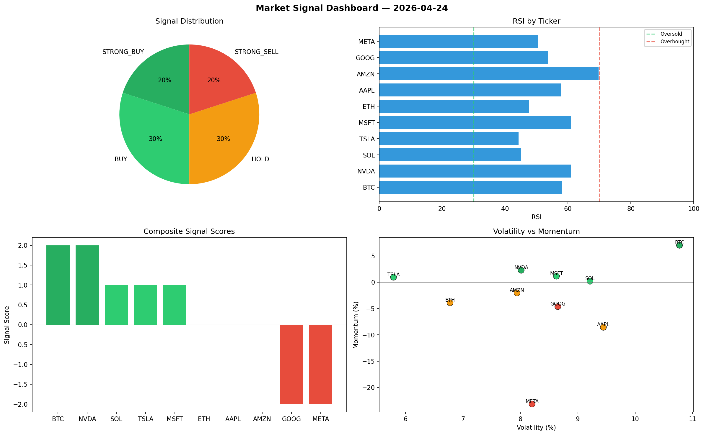

# Market Signal Report — 2026-04-24

**Run ID:** `cbd99ac71d` | **Buy:** 5 | **Sell:** 2 | **Hold:** 3

## Signal Dashboard

| Ticker | Price | Signal | Score | RSI | Momentum | Confidence |
|--------|-------|--------|-------|-----|----------|------------|
| BTC | $459.39 | **STRONG_BUY** | 2 | 58.01 | 0.0702 | 0.5 |
| NVDA | $3166.88 | **STRONG_BUY** | 2 | 61.03 | 0.0227 | 0.5 |
| SOL | $2516.08 | **BUY** | 1 | 45.18 | 0.0019 | 0.25 |
| TSLA | $128.07 | **BUY** | 1 | 44.28 | 0.0095 | 0.25 |
| MSFT | $4710.78 | **BUY** | 1 | 60.89 | 0.0115 | 0.25 |
| ETH | $799.15 | **HOLD** | 0 | 47.57 | -0.039 | 0.0 |
| AAPL | $2312.21 | **HOLD** | 0 | 57.71 | -0.0856 | 0.0 |
| AMZN | $4578.84 | **HOLD** | 0 | 69.71 | -0.0203 | 0.0 |
| GOOG | $4745.55 | **STRONG_SELL** | -2 | 53.63 | -0.0463 | 0.5 |
| META | $105.28 | **STRONG_SELL** | -2 | 50.54 | -0.2315 | 0.5 |

## Delta vs Yesterday

| Ticker | Today | Yesterday | Price Change | Signal Changed |
|--------|-------|-----------|-------------|----------------|
| BTC | STRONG_BUY | SELL | 📉 -80.6% | ⚠️ YES |
| NVDA | STRONG_BUY | STRONG_BUY | 📉 -0.2% | — |
| SOL | BUY | STRONG_BUY | 📉 -13.96% | ⚠️ YES |
| TSLA | BUY | STRONG_SELL | 📉 -79.48% | ⚠️ YES |
| MSFT | BUY | HOLD | 📉 -1.82% | ⚠️ YES |
| ETH | HOLD | STRONG_SELL | 📉 -59.05% | ⚠️ YES |
| AAPL | HOLD | STRONG_BUY | 📈 16.91% | ⚠️ YES |
| AMZN | HOLD | STRONG_BUY | 📈 120.02% | ⚠️ YES |
| GOOG | STRONG_SELL | SELL | 📈 1877.97% | ⚠️ YES |
| META | STRONG_SELL | BUY | 📉 -96.28% | ⚠️ YES |