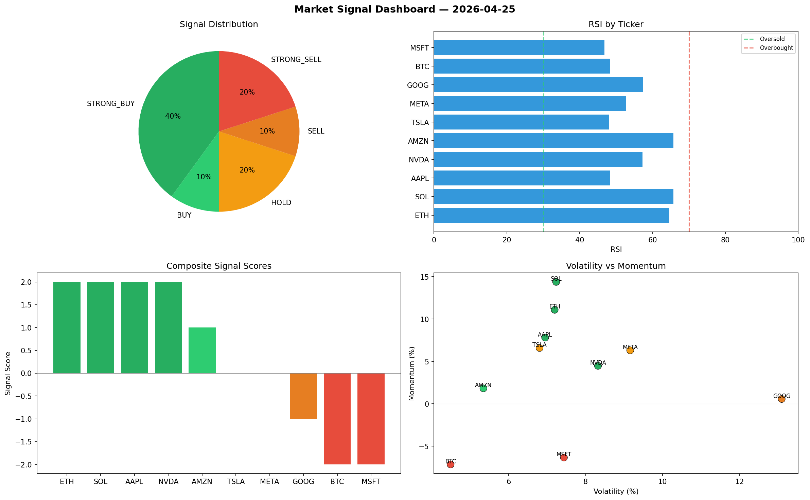

# Market Signal Report — 2026-04-25

**Run ID:** `12dd799663` | **Buy:** 5 | **Sell:** 3 | **Hold:** 2

## Signal Dashboard

| Ticker | Price | Signal | Score | RSI | Momentum | Confidence |
|--------|-------|--------|-------|-----|----------|------------|
| ETH | $5019.85 | **STRONG_BUY** | 2 | 64.61 | 0.111 | 0.5 |
| SOL | $703.2 | **STRONG_BUY** | 2 | 65.72 | 0.1439 | 0.5 |
| AAPL | $1243.03 | **STRONG_BUY** | 2 | 48.3 | 0.0781 | 0.5 |
| NVDA | $3459.03 | **STRONG_BUY** | 2 | 57.2 | 0.0448 | 0.5 |
| AMZN | $2614.48 | **BUY** | 1 | 65.77 | 0.0183 | 0.25 |
| TSLA | $3065.73 | **HOLD** | 0 | 48.03 | 0.0659 | 0.0 |
| META | $2558.28 | **HOLD** | 0 | 52.64 | 0.0631 | 0.0 |
| GOOG | $2566.45 | **SELL** | -1 | 57.33 | 0.0057 | 0.25 |
| BTC | $2124.14 | **STRONG_SELL** | -2 | 48.26 | -0.0716 | 0.5 |
| MSFT | $1172.3 | **STRONG_SELL** | -2 | 46.78 | -0.0635 | 0.5 |

## Delta vs Yesterday

| Ticker | Today | Yesterday | Price Change | Signal Changed |
|--------|-------|-----------|-------------|----------------|
| ETH | STRONG_BUY | STRONG_BUY | 📈 0.94% | — |
| SOL | STRONG_BUY | SELL | 📉 -77.33% | ⚠️ YES |
| AAPL | STRONG_BUY | HOLD | 📉 -68.49% | ⚠️ YES |
| NVDA | STRONG_BUY | HOLD | 📈 12.57% | ⚠️ YES |
| AMZN | BUY | HOLD | 📉 -14.26% | ⚠️ YES |
| TSLA | HOLD | HOLD | 📈 194.86% | — |
| META | HOLD | HOLD | 📈 126.0% | — |
| GOOG | SELL | STRONG_SELL | 📉 -34.57% | ⚠️ YES |
| BTC | STRONG_SELL | SELL | 📈 115.92% | ⚠️ YES |
| MSFT | STRONG_SELL | HOLD | 📉 -71.12% | ⚠️ YES |